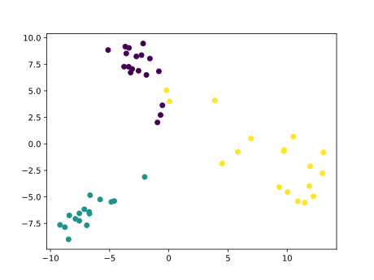

# Gesture Identification using Arduino and MicroML

In this post I'm going to replicate the tutorial found on the [Tensorflow blog](https://blog.tensorflow.org/2019/11/how-to-get-started-with-machine.html)
where an Arduino BLE 33 Nano Sense is used to classify IMU readings into gestures. 
Here, however, I'm not using an Arm Cortex M4 chip: I'll use an Arduino Nano
(2 Kb of RAM) :fire::fire::fire:!

In this project the features are going to be the 30 IMU accelerometer readings, 
taken starting from when a movement is detected.

The steps are almost the same depicted in the [tutorial about fruit identification](#todo):

 1. record sample data: repeat each gesture a few times and save the
 values from the serial monitor to a file, one for each gesture
 2. train an SVM classifier on your laptop with Python's scikit-learn
 3. run `microml` on the trained classifier
 4. copy and include the `model.h` file in your Arduino project

This is the plot of three gestures I recorded as an example (2 pca components plotted).



Now running the inference is just a matter of packing the 30 readings in an array
and call `predict`:

```cpp
#define print(x) Serial.print(x)

#include "imu_capture.h"
#include "model.h"

#define ACCEL_THRESHOLD 3
#define NUM_SAMPLES 30
#define csv(x) print(x); print('\t');

void record();
void classify();


void setup() {
  Serial.begin(115200);
  delay(3000);

  if (!imu_setup()) {
    print("Cannot start IMU\n");
    while (1) delay(10000);
  }

  print("ax,ay,az,gx,gy,gz\n");
}


void loop() {
  float ax, ay, az, gx, gy, gz;

  imu_read(&ax, &ay, &az, &gx, &gy, &gz);

  // naive motion detection
  if (abs(ax) + abs(ay) + abs(az) < ACCEL_THRESHOLD)
    return;
  
  // comment the one you don't need
  record();
  //classify();
}


void record() {
  float ax, ay, az, gx, gy, gz;

  for (uint16_t i = 0; i < NUM_SAMPLES; i++) {
    imu_read(&ax, &ay, &az, &gx, &gy, &gz);
    csv(ax);
    csv(ay);
    csv(az);
    csv(gx);
    csv(gy);
    csv(gz);
    print('\n');
  }

  print("===========================\n");
  delay(2000);
}


void classify() {
  float ax, ay, az, gx, gy, gz;
  float features[6 * NUM_SAMPLES] = { 0 };

  for (uint16_t i = 0; i < NUM_SAMPLES; i++) {
    imu_read(&ax, &ay, &az, &gx, &gy, &gz);
    features[i * 6 + 0] = ax;
    features[i * 6 + 1] = ay;
    features[i * 6 + 2] = az;
    features[i * 6 + 3] = gx;
    features[i * 6 + 4] = gy;
    features[i * 6 + 5] = gz;
  }

  print("Gesture detected ");
  print(classIdxToName(predict(features)));
  print('\n');
  delay(2000);
}
```

The contents of the file `imu_capture.h` will vary based on the device you're using.<br/>
In the case of an `MPU6050` it will look like the following:

```cpp
#include <Wire.h>
// library from https://github.com/jrowberg/i2cdevlib/tree/master/Arduino/MPU6050
#include <MPU6050.h>
#define OUTPUT_READABLE_ACCELGYRO

MPU6050 imu;

void imu_setup() {
    Wire.begin();
    imu.initialize();
}

void imu_read(float *ax, float *ay, float *az, float *gx, float *gy, float *gz) {
    imu.getMotion6(&ax, &ay, &az, &gx, &gy, &gz);
}
```

In the case of an `MPU9250` it will look like the following:

```cpp
#include <Wire.h>
// library from https://github.com/bolderflight/MPU9250
#include <MPU9250.h>

MPU9250 imu(Wire, 0x68);

void imu_setup() {
    Wire.begin();
    imu.begin();
}

void imu_read(float *ax, float *ay, float *az, float *gx, float *gy, float *gz) {
    imu.readSensor();

    *ax = imu.getAccelX_mss();
    *ay = imu.getAccelY_mss();
    *az = imu.getAccelZ_mss();
    *gx = imu.getGyroX_rads();
    *gy = imu.getGyroY_rads();
    *gz = imu.getGyroZ_rads();
}
```

Again I'll paste my `model.h` for reference. You can note that the model size
is only linear in the number of features (`6 * NUM_SAMPLES` in this case)
and that the support vectors can be quite low for well separable data (8 in my case).

```cpp

#pragma once


float apply_kernel(float *x, float *w) {
  float kernel = 0;

  for (uint8_t i = 0; i < 120; i++)
    // linear kernel
    kernel += x[i] * w[i];
    
  return kernel;
}

int predict(float *x) {
    float w[120];
    float kernels[8] = { 0 };
    float decisions[6] = { 0 };
    int votes[3] = { 0 };

    // compute kernels
    
    w[0] = 0.75; w[1] = -0.44; w[2] = 3.11; w[3] = 139.1; w[4] = 27.95; w[5] = -39.55; w[6] = 0.75; w[7] = -0.44; w[8] = 3.11; w[9] = 139.1; w[10] = 27.95; w[11] = -39.55; w[12] = 0.69; w[13] = -0.73; w[14] = 3.43; w[15] = 227.36; w[16] = -15.5; w[17] = -68.79; w[18] = 0.69; w[19] = -0.73; w[20] = 3.43; w[21] = 227.36; w[22] = -15.5; w[23] = -68.79; w[24] = 0.69; w[25] = -0.73; w[26] = 3.43; w[27] = 296.94; w[28] = -33.39; w[29] = -88.2; w[30] = 0.22; w[31] = -0.95; w[32] = 3.63; w[33] = 296.94; w[34] = -33.39; w[35] = -88.2; w[36] = 0.22; w[37] = -0.95; w[38] = 3.63; w[39] = 296.94; w[40] = -33.39; w[41] = -88.2; w[42] = 0.22; w[43] = -0.95; w[44] = 3.63; w[45] = 358.95; w[46] = -35.52; w[47] = -84.35; w[48] = -0.18; w[49] = -0.99; w[50] = 3.82; w[51] = 358.95; w[52] = -35.52; w[53] = -84.35; w[54] = -0.4; w[55] = -0.98; w[56] = 3.91; w[57] = 429.32; w[58] = -55.85; w[59] = -79.22; w[60] = -0.4; w[61] = -0.98; w[62] = 3.91; w[63] = 429.32; w[64] = -55.85; w[65] = -79.22; w[66] = -0.28; w[67] = -1.09; w[68] = 3.79; w[69] = 492.55; w[70] = -86.98; w[71] = -64.58; w[72] = -0.28; w[73] = -1.09; w[74] = 3.79; w[75] = 492.55; w[76] = -86.98; w[77] = -64.58; w[78] = 0.12; w[79] = -1.26; w[80] = 3.6; w[81] = 546.51; w[82] = -80.2; w[83] = -37.78; w[84] = 0.12; w[85] = -1.26; w[86] = 3.6; w[87] = 546.51; w[88] = -80.2; w[89] = -37.78; w[90] = 0.21; w[91] = -1.36; w[92] = 3.27; w[93] = 603.09; w[94] = -45.47; w[95] = -36.8; w[96] = 0.21; w[97] = -1.36; w[98] = 3.27; w[99] = 655.82; w[100] = -9.09; w[101] = -39.49; w[102] = 0.3; w[103] = -1.42; w[104] = 2.78; w[105] = 655.82; w[106] = -9.09; w[107] = -39.49; w[108] = 0.3; w[109] = -1.42; w[110] = 2.78; w[111] = 707.58; w[112] = 12.21; w[113] = -39.79; w[114] = 0.28; w[115] = -1.5; w[116] = 2.15; w[117] = 707.58; w[118] = 12.21; w[119] = -39.79; 
    kernels[0] = apply_kernel(x, w);    
    w[0] = -1.05; w[1] = -1.27; w[2] = 2.32; w[3] = -514.89; w[4] = 522.71; w[5] = 55.6; w[6] = -1.05; w[7] = -1.27; w[8] = 2.32; w[9] = -379.46; w[10] = 961.49; w[11] = 30.21; w[12] = -0.96; w[13] = -0.94; w[14] = 4.19; w[15] = -379.46; w[16] = 961.49; w[17] = 30.21; w[18] = -0.96; w[19] = -0.94; w[20] = 4.19; w[21] = -379.46; w[22] = 961.49; w[23] = 30.21; w[24] = -0.96; w[25] = -0.94; w[26] = 4.19; w[27] = -124.27; w[28] = 663.94; w[29] = 74.16; w[30] = -0.01; w[31] = -1.28; w[32] = 6.4; w[33] = -124.27; w[34] = 663.94; w[35] = 74.16; w[36] = -0.01; w[37] = -1.28; w[38] = 6.4; w[39] = -124.27; w[40] = 663.94; w[41] = 74.16; w[42] = -0.1; w[43] = -0.27; w[44] = 2.5; w[45] = 58.29; w[46] = -99.73; w[47] = 40.28; w[48] = -0.1; w[49] = -0.27; w[50] = 2.5; w[51] = 58.29; w[52] = -99.73; w[53] = 40.28; w[54] = -0.27; w[55] = -0.57; w[56] = 1.12; w[57] = 105.04; w[58] = -279.48; w[59] = 49.13; w[60] = -0.27; w[61] = -0.57; w[62] = 1.12; w[63] = 105.04; w[64] = -279.48; w[65] = 49.13; w[66] = 0.11; w[67] = -0.45; w[68] = 0.82; w[69] = 113.4; w[70] = -284.0; w[71] = 70.56; w[72] = 0.11; w[73] = -0.45; w[74] = 0.82; w[75] = 99.12; w[76] = -316.65; w[77] = 58.96; w[78] = 0.25; w[79] = -0.18; w[80] = 0.7; w[81] = 99.12; w[82] = -316.65; w[83] = 58.96; w[84] = 0.25; w[85] = -0.18; w[86] = 0.7; w[87] = 68.18; w[88] = -332.46; w[89] = 42.85; w[90] = 0.29; w[91] = -0.1; w[92] = 0.46; w[93] = 68.18; w[94] = -332.46; w[95] = 42.85; w[96] = 0.23; w[97] = -0.12; w[98] = 0.32; w[99] = 42.36; w[100] = -280.94; w[101] = 30.27; w[102] = 0.23; w[103] = -0.12; w[104] = 0.32; w[105] = 42.36; w[106] = -280.94; w[107] = 30.27; w[108] = 0.17; w[109] = -0.07; w[110] = 0.37; w[111] = 17.33; w[112] = -179.5; w[113] = 22.46; w[114] = 0.17; w[115] = -0.07; w[116] = 0.37; w[117] = 17.33; w[118] = -179.5; w[119] = 22.46; 
    kernels[1] = apply_kernel(x, w);    
    w[0] = -0.25; w[1] = -0.71; w[2] = 3.04; w[3] = 151.31; w[4] = -26.25; w[5] = -68.36; w[6] = -0.25; w[7] = -0.71; w[8] = 3.04; w[9] = 209.29; w[10] = -1.16; w[11] = -50.42; w[12] = -0.4; w[13] = -0.49; w[14] = 3.58; w[15] = 209.29; w[16] = -1.16; w[17] = -50.42; w[18] = -0.4; w[19] = -0.49; w[20] = 3.58; w[21] = 209.29; w[22] = -1.16; w[23] = -50.42; w[24] = -0.49; w[25] = -0.59; w[26] = 3.93; w[27] = 282.84; w[28] = -3.05; w[29] = -33.57; w[30] = -0.49; w[31] = -0.59; w[32] = 3.93; w[33] = 282.84; w[34] = -3.05; w[35] = -33.57; w[36] = -0.49; w[37] = -0.59; w[38] = 3.93; w[39] = 282.84; w[40] = -3.05; w[41] = -33.57; w[42] = -0.62; w[43] = -0.74; w[44] = 4.02; w[45] = 367.8; w[46] = -32.35; w[47] = -22.89; w[48] = -0.62; w[49] = -0.74; w[50] = 4.02; w[51] = 367.8; w[52] = -32.35; w[53] = -22.89; w[54] = -0.69; w[55] = -0.9; w[56] = 3.94; w[57] = 439.88; w[58] = -64.03; w[59] = -22.95; w[60] = -0.69; w[61] = -0.9; w[62] = 3.94; w[63] = 508.85; w[64] = -72.63; w[65] = -8.97; w[66] = -0.62; w[67] = -1.04; w[68] = 3.58; w[69] = 508.85; w[70] = -72.63; w[71] = -8.97; w[72] = -0.62; w[73] = -1.04; w[74] = 3.58; w[75] = 578.31; w[76] = -56.15; w[77] = 9.52; w[78] = -0.53; w[79] = -1.16; w[80] = 3.15; w[81] = 578.31; w[82] = -56.15; w[83] = 9.52; w[84] = -0.37; w[85] = -1.2; w[86] = 2.73; w[87] = 640.81; w[88] = -28.02; w[89] = 29.6; w[90] = -0.37; w[91] = -1.2; w[92] = 2.73; w[93] = 640.81; w[94] = -28.02; w[95] = 29.6; w[96] = -0.22; w[97] = -1.25; w[98] = 2.18; w[99] = 693.18; w[100] = -8.67; w[101] = 43.7; w[102] = -0.22; w[103] = -1.25; w[104] = 2.18; w[105] = 693.18; w[106] = -8.67; w[107] = 43.7; w[108] = -0.11; w[109] = -1.29; w[110] = 1.57; w[111] = 723.57; w[112] = -4.15; w[113] = 51.27; w[114] = -0.11; w[115] = -1.29; w[116] = 1.57; w[117] = 723.57; w[118] = -4.15; w[119] = 51.27; 
    kernels[2] = apply_kernel(x, w);    
    w[0] = -2.06; w[1] = -0.52; w[2] = 1.09; w[3] = 63.42; w[4] = -388.0; w[5] = 144.04; w[6] = -2.06; w[7] = -0.52; w[8] = 1.09; w[9] = 63.42; w[10] = -388.0; w[11] = 144.04; w[12] = -2.06; w[13] = -0.58; w[14] = 1.51; w[15] = 72.51; w[16] = -469.48; w[17] = 250.12; w[18] = -2.06; w[19] = -0.58; w[20] = 1.51; w[21] = 72.51; w[22] = -469.48; w[23] = 250.12; w[24] = -2.06; w[25] = -0.58; w[26] = 1.51; w[27] = 102.23; w[28] = -465.76; w[29] = 359.74; w[30] = -2.03; w[31] = -0.56; w[32] = 1.58; w[33] = 102.23; w[34] = -465.76; w[35] = 359.74; w[36] = -2.03; w[37] = -0.56; w[38] = 1.58; w[39] = 102.23; w[40] = -465.76; w[41] = 359.74; w[42] = -2.35; w[43] = -0.84; w[44] = 1.37; w[45] = 134.03; w[46] = -410.03; w[47] = 481.45; w[48] = -2.35; w[49] = -0.84; w[50] = 1.37; w[51] = 134.03; w[52] = -410.03; w[53] = 481.45; w[54] = -2.65; w[55] = -1.15; w[56] = 1.22; w[57] = 169.74; w[58] = -268.86; w[59] = 613.28; w[60] = -2.65; w[61] = -1.15; w[62] = 1.22; w[63] = 204.47; w[64] = -103.15; w[65] = 775.45; w[66] = -2.37; w[67] = -1.4; w[68] = 1.06; w[69] = 204.47; w[70] = -103.15; w[71] = 775.45; w[72] = -1.82; w[73] = -1.35; w[74] = 0.6; w[75] = 231.26; w[76] = 116.27; w[77] = 931.82; w[78] = -1.82; w[79] = -1.35; w[80] = 0.6; w[81] = 231.26; w[82] = 116.27; w[83] = 931.82; w[84] = -0.9; w[85] = -2.1; w[86] = 0.44; w[87] = 196.29; w[88] = 343.57; w[89] = 1052.61; w[90] = -0.9; w[91] = -2.1; w[92] = 0.44; w[93] = 196.29; w[94] = 343.57; w[95] = 1052.61; w[96] = 0.05; w[97] = -2.55; w[98] = 0.21; w[99] = 136.96; w[100] = 468.44; w[101] = 1113.83; w[102] = 0.05; w[103] = -2.55; w[104] = 0.21; w[105] = 74.65; w[106] = 367.92; w[107] = 1126.04; w[108] = 2.25; w[109] = -1.95; w[110] = 0.6; w[111] = 74.65; w[112] = 367.92; w[113] = 1126.04; w[114] = 3.87; w[115] = -1.08; w[116] = 0.64; w[117] = 55.91; w[118] = 254.03; w[119] = 1017.09; 
    kernels[3] = apply_kernel(x, w);    
    w[0] = -2.37; w[1] = -1.03; w[2] = 0.86; w[3] = 59.63; w[4] = -227.05; w[5] = 531.19; w[6] = -2.37; w[7] = -1.03; w[8] = 0.86; w[9] = 59.02; w[10] = -156.86; w[11] = 652.95; w[12] = -2.15; w[13] = -1.16; w[14] = 0.37; w[15] = 59.02; w[16] = -156.86; w[17] = 652.95; w[18] = -2.15; w[19] = -1.16; w[20] = 0.37; w[21] = 59.02; w[22] = -156.86; w[23] = 652.95; w[24] = -2.15; w[25] = -1.16; w[26] = 0.37; w[27] = 37.29; w[28] = -75.07; w[29] = 760.01; w[30] = -1.8; w[31] = -1.24; w[32] = 0.4; w[33] = 37.29; w[34] = -75.07; w[35] = 760.01; w[36] = -1.8; w[37] = -1.24; w[38] = 0.4; w[39] = 37.29; w[40] = -75.07; w[41] = 760.01; w[42] = -0.5; w[43] = -1.82; w[44] = 3.31; w[45] = 6.29; w[46] = 46.94; w[47] = 828.0; w[48] = -0.5; w[49] = -1.82; w[50] = 3.31; w[51] = 6.29; w[52] = 46.94; w[53] = 828.0; w[54] = -0.3; w[55] = -1.19; w[56] = 0.5; w[57] = 35.83; w[58] = -172.91; w[59] = 848.08; w[60] = -0.3; w[61] = -1.19; w[62] = 0.5; w[63] = 35.83; w[64] = -172.91; w[65] = 848.08; w[66] = 0.6; w[67] = -1.2; w[68] = 1.21; w[69] = 12.63; w[70] = -159.85; w[71] = 835.51; w[72] = 0.6; w[73] = -1.2; w[74] = 1.21; w[75] = 12.63; w[76] = -159.85; w[77] = 835.51; w[78] = 0.82; w[79] = -1.23; w[80] = 1.03; w[81] = 1.34; w[82] = -61.28; w[83] = 773.62; w[84] = 0.82; w[85] = -1.23; w[86] = 1.03; w[87] = -20.26; w[88] = 19.78; w[89] = 709.11; w[90] = 0.73; w[91] = -1.15; w[92] = 0.78; w[93] = -20.26; w[94] = 19.78; w[95] = 709.11; w[96] = 0.73; w[97] = -1.15; w[98] = 0.78; w[99] = -47.73; w[100] = 26.18; w[101] = 668.58; w[102] = 0.75; w[103] = -1.24; w[104] = 0.93; w[105] = -47.73; w[106] = 26.18; w[107] = 668.58; w[108] = 0.94; w[109] = -1.33; w[110] = 0.66; w[111] = -63.9; w[112] = 12.88; w[113] = 635.38; w[114] = 0.94; w[115] = -1.33; w[116] = 0.66; w[117] = -63.9; w[118] = 12.88; w[119] = 635.38; 
    kernels[4] = apply_kernel(x, w);    
    w[0] = -8.0; w[1] = -0.46; w[2] = 4.05; w[3] = 13.67; w[4] = -92.83; w[5] = -139.53; w[6] = -8.0; w[7] = -0.46; w[8] = 4.05; w[9] = 23.5; w[10] = -167.48; w[11] = 557.86; w[12] = 3.25; w[13] = -0.88; w[14] = -1.46; w[15] = 23.5; w[16] = -167.48; w[17] = 557.86; w[18] = 3.25; w[19] = -0.88; w[20] = -1.46; w[21] = 23.5; w[22] = -167.48; w[23] = 557.86; w[24] = 3.25; w[25] = -0.88; w[26] = -1.46; w[27] = 42.72; w[28] = 363.83; w[29] = 283.69; w[30] = 3.64; w[31] = -0.51; w[32] = 0.95; w[33] = 42.72; w[34] = 363.83; w[35] = 283.69; w[36] = 3.64; w[37] = -0.51; w[38] = 0.95; w[39] = 42.72; w[40] = 363.83; w[41] = 283.69; w[42] = 1.76; w[43] = -0.32; w[44] = 1.11; w[45] = 16.66; w[46] = 257.02; w[47] = 55.97; w[48] = 1.76; w[49] = -0.32; w[50] = 1.11; w[51] = 16.66; w[52] = 257.02; w[53] = 55.97; w[54] = -3.19; w[55] = -0.94; w[56] = -1.55; w[57] = -13.61; w[58] = -14.53; w[59] = 50.84; w[60] = -3.19; w[61] = -0.94; w[62] = -1.55; w[63] = -13.61; w[64] = -14.53; w[65] = 50.84; w[66] = 0.72; w[67] = 0.15; w[68] = 2.09; w[69] = -70.86; w[70] = -358.22; w[71] = 185.42; w[72] = 0.72; w[73] = 0.15; w[74] = 2.09; w[75] = -70.86; w[76] = -358.22; w[77] = 185.42; w[78] = -0.31; w[79] = -0.37; w[80] = 0.99; w[81] = -26.73; w[82] = -93.44; w[83] = 89.48; w[84] = -0.31; w[85] = -0.37; w[86] = 0.99; w[87] = -17.33; w[88] = -31.98; w[89] = 65.31; w[90] = -0.05; w[91] = -0.38; w[92] = 1.0; w[93] = -17.33; w[94] = -31.98; w[95] = 65.31; w[96] = -0.05; w[97] = -0.38; w[98] = 1.0; w[99] = -12.27; w[100] = -12.7; w[101] = 46.26; w[102] = -0.02; w[103] = -0.37; w[104] = 1.06; w[105] = -12.27; w[106] = -12.7; w[107] = 46.26; w[108] = -0.02; w[109] = -0.37; w[110] = 1.0; w[111] = -5.31; w[112] = 18.13; w[113] = 27.65; w[114] = -0.02; w[115] = -0.37; w[116] = 1.0; w[117] = -5.31; w[118] = 18.13; w[119] = 27.65; 
    kernels[5] = apply_kernel(x, w);    
    w[0] = -4.42; w[1] = -1.99; w[2] = 2.11; w[3] = -88.2; w[4] = 211.55; w[5] = -98.27; w[6] = -4.42; w[7] = -1.99; w[8] = 2.11; w[9] = -33.57; w[10] = -16.78; w[11] = 100.71; w[12] = 0.3; w[13] = -0.12; w[14] = 0.92; w[15] = -33.57; w[16] = -16.78; w[17] = 100.71; w[18] = 0.3; w[19] = -0.12; w[20] = 0.92; w[21] = -33.57; w[22] = -16.78; w[23] = 100.71; w[24] = 0.19; w[25] = -0.39; w[26] = 0.99; w[27] = -24.78; w[28] = -40.1; w[29] = 84.53; w[30] = 0.19; w[31] = -0.39; w[32] = 0.99; w[33] = -24.78; w[34] = -40.1; w[35] = 84.53; w[36] = 0.19; w[37] = -0.39; w[38] = 0.99; w[39] = -24.78; w[40] = -40.1; w[41] = 84.53; w[42] = 0.07; w[43] = -0.29; w[44] = 0.99; w[45] = -22.83; w[46] = -12.27; w[47] = 54.5; w[48] = 0.07; w[49] = -0.29; w[50] = 0.99; w[51] = -22.83; w[52] = -12.27; w[53] = 54.5; w[54] = 0.09; w[55] = -0.3; w[56] = 1.01; w[57] = -18.25; w[58] = -11.35; w[59] = 34.79; w[60] = 0.09; w[61] = -0.3; w[62] = 1.01; w[63] = -18.25; w[64] = -11.35; w[65] = 34.79; w[66] = 0.1; w[67] = -0.26; w[68] = 0.97; w[69] = -15.44; w[70] = -11.78; w[71] = 19.84; w[72] = 0.1; w[73] = -0.26; w[74] = 0.97; w[75] = -15.44; w[76] = -11.78; w[77] = 19.84; w[78] = 0.08; w[79] = -0.28; w[80] = 0.97; w[81] = -7.45; w[82] = -4.39; w[83] = 2.75; w[84] = 0.08; w[85] = -0.28; w[86] = 0.97; w[87] = -7.45; w[88] = -4.39; w[89] = 2.75; w[90] = 0.1; w[91] = -0.28; w[92] = 0.99; w[93] = -0.12; w[94] = 1.53; w[95] = -11.17; w[96] = 0.1; w[97] = -0.28; w[98] = 0.99; w[99] = -0.12; w[100] = 1.53; w[101] = -11.17; w[102] = 0.1; w[103] = -0.26; w[104] = 1.01; w[105] = 5.37; w[106] = 4.46; w[107] = -20.63; w[108] = 0.1; w[109] = -0.26; w[110] = 1.01; w[111] = 5.37; w[112] = 4.46; w[113] = -20.63; w[114] = 0.1; w[115] = -0.26; w[116] = 1.0; w[117] = 10.86; w[118] = 9.16; w[119] = -30.94; 
    kernels[6] = apply_kernel(x, w);    
    w[0] = -8.0; w[1] = -1.64; w[2] = -1.66; w[3] = -4.39; w[4] = -56.46; w[5] = -416.44; w[6] = -8.0; w[7] = -1.64; w[8] = -1.66; w[9] = -4.39; w[10] = -56.46; w[11] = -416.44; w[12] = 4.19; w[13] = -2.04; w[14] = 7.94; w[15] = -124.88; w[16] = -875.06; w[17] = 296.87; w[18] = 4.19; w[19] = -2.04; w[20] = 7.94; w[21] = -124.88; w[22] = -875.06; w[23] = 296.87; w[24] = 4.19; w[25] = -2.04; w[26] = 7.94; w[27] = -124.88; w[28] = -875.06; w[29] = 296.87; w[30] = 3.28; w[31] = -0.29; w[32] = 2.89; w[33] = 38.82; w[34] = -132.57; w[35] = 331.67; w[36] = 3.28; w[37] = -0.29; w[38] = 2.89; w[39] = 38.82; w[40] = -132.57; w[41] = 331.67; w[42] = -1.78; w[43] = -0.7; w[44] = 0.4; w[45] = 67.14; w[46] = 400.21; w[47] = 89.36; w[48] = -1.78; w[49] = -0.7; w[50] = 0.4; w[51] = 67.14; w[52] = 400.21; w[53] = 89.36; w[54] = -0.87; w[55] = -0.82; w[56] = 0.25; w[57] = 18.01; w[58] = 163.09; w[59] = 121.89; w[60] = -0.87; w[61] = -0.82; w[62] = 0.25; w[63] = 18.01; w[64] = 163.09; w[65] = 121.89; w[66] = 0.97; w[67] = -0.63; w[68] = 1.02; w[69] = -23.8; w[70] = -91.86; w[71] = 174.01; w[72] = 0.97; w[73] = -0.63; w[74] = 1.02; w[75] = -23.8; w[76] = -91.86; w[77] = 174.01; w[78] = -0.35; w[79] = -0.34; w[80] = 1.08; w[81] = -21.67; w[82] = -92.77; w[83] = 117.8; w[84] = -0.35; w[85] = -0.34; w[86] = 1.08; w[87] = -19.71; w[88] = -56.64; w[89] = 103.33; w[90] = -0.1; w[91] = -0.37; w[92] = 1.25; w[93] = -19.71; w[94] = -56.64; w[95] = 103.33; w[96] = -0.1; w[97] = -0.37; w[98] = 1.25; w[99] = -12.15; w[100] = 33.87; w[101] = 89.48; w[102] = -0.04; w[103] = -0.44; w[104] = 1.18; w[105] = -12.15; w[106] = 33.87; w[107] = 89.48; w[108] = -0.05; w[109] = -0.45; w[110] = 0.98; w[111] = -5.37; w[112] = 109.37; w[113] = 71.41; w[114] = -0.05; w[115] = -0.45; w[116] = 0.98; w[117] = -5.37; w[118] = 109.37; w[119] = 71.41; 
    kernels[7] = apply_kernel(x, w);    

    // vote
    decisions[0] = 0.5853179
         + kernels[4] * -1e-07;
    decisions[1] = -0.8834826
         + kernels[0] * 3e-07 + kernels[1] * 3e-07
         + kernels[6] * -7e-07;
    decisions[2] = -1.1779485
         + kernels[4] * 2e-07
         + kernels[5] * -1e-07;

    votes[decisions[0] > 0 ? 0 : 1] += 1; 
    votes[decisions[1] > 0 ? 0 : 2] += 1; 
    votes[decisions[2] > 0 ? 1 : 2] += 1; 

    int classVal = -1;
    int classIdx = -1;

    for (int i = 0; i < 3; i++) {
        if (votes[i] > classVal) {
            classVal = votes[i];
            classIdx = i;
        }
    }

    return classIdx;
}

void self_test() {
    int correct = 0;
    float X[15][120] = {
             {  -2.35 , -0.84 , 1.65 , 98.75 , -634.58 , 63.35 , -2.35 , -0.84 , 1.65 , 98.75 , -634.58 , 63.35 , -2.76 , -1.06 , 1.89 , 124.69 , -630.37 , 217.47 , -2.76 , -1.06 , 1.89 , 124.69 , -630.37 , 217.47 , -2.76 , -1.06 , 1.89 , 180.42 , -584.9 , 392.94 , -2.43 , -1.24 , 2.28 , 180.42 , -584.9 , 392.94 , -2.43 , -1.24 , 2.28 , 180.42 , -584.9 , 392.94 , -2.29 , -1.42 , 2.25 , 255.0 , -497.8 , 564.51 , -2.29 , -1.42 , 2.25 , 255.0 , -497.8 , 564.51 , -2.37 , -1.54 , 1.85 , 345.03 , -337.04 , 725.65 , -2.37 , -1.54 , 1.85 , 345.03 , -337.04 , 725.65 , -2.07 , -2.11 , 1.49 , 404.85 , -125.79 , 889.59 , -2.07 , -2.11 , 1.49 , 435.49 , 135.8 , 1042.66 , -0.76 , -2.35 , 1.32 , 435.49 , 135.8 , 1042.66 , -0.29 , -2.5 , 0.52 , 441.47 , 349.79 , 1130.62 , -0.29 , -2.5 , 0.52 , 441.47 , 349.79 , 1130.62 , 1.07 , -2.56 , 0.29 , 411.25 , 470.83 , 1189.09 , 1.07 , -2.56 , 0.29 , 357.06 , 613.16 , 1166.63 , 2.43 , -2.47 , 0.05 , 357.06 , 613.16 , 1166.63 , 3.51 , -1.8 , -0.16 , 277.34 , 654.97 , 1059.63  }
            , {  1.43 , -0.18 , 2.35 , 7.45 , 24.84 , -11.47 , 1.43 , -0.18 , 2.35 , 78.92 , 88.44 , -64.64 , 0.73 , -0.25 , 3.19 , 78.92 , 88.44 , -64.64 , 0.73 , -0.25 , 3.19 , 78.92 , 88.44 , -64.64 , 0.35 , -0.49 , 3.5 , 177.31 , 68.42 , -90.58 , 0.35 , -0.49 , 3.5 , 177.31 , 68.42 , -90.58 , 0.35 , -0.49 , 3.5 , 177.31 , 68.42 , -90.58 , 0.19 , -0.7 , 3.87 , 261.47 , 31.56 , -101.81 , 0.19 , -0.7 , 3.87 , 261.47 , 31.56 , -101.81 , 0.19 , -0.7 , 3.87 , 344.48 , 19.9 , -104.31 , 0.15 , -0.85 , 4.24 , 344.48 , 19.9 , -104.31 , -0.09 , -0.93 , 4.11 , 434.45 , 31.56 , -99.91 , -0.09 , -0.93 , 4.11 , 434.45 , 31.56 , -99.91 , -0.49 , -1.21 , 3.78 , 512.76 , 39.61 , -104.68 , -0.49 , -1.21 , 3.78 , 512.76 , 39.61 , -104.68 , -0.6 , -1.34 , 3.33 , 566.16 , 40.71 , -87.16 , -0.6 , -1.34 , 3.33 , 604.68 , 43.88 , -51.57 , -0.41 , -1.32 , 2.85 , 604.68 , 43.88 , -51.57 , -0.41 , -1.32 , 2.85 , 638.49 , 76.66 , -19.1 , -0.21 , -1.28 , 2.51 , 638.49 , 76.66 , -19.1  }
            , {  -0.11 , -1.06 , 3.22 , 553.77 , -61.22 , -17.76 , -0.11 , -1.06 , 3.22 , 553.77 , -61.22 , -17.76 , -0.11 , -1.06 , 3.22 , 553.77 , -61.22 , -17.76 , 0.07 , -1.11 , 2.95 , 616.09 , 0.18 , -12.08 , 0.07 , -1.11 , 2.95 , 616.09 , 0.18 , -12.08 , 0.07 , -1.11 , 2.95 , 675.11 , 62.5 , -9.52 , 0.1 , -1.17 , 2.66 , 675.11 , 62.5 , -9.52 , 0.1 , -1.17 , 2.66 , 675.11 , 62.5 , -9.52 , 0.03 , -1.24 , 2.2 , 724.49 , 100.1 , -13.24 , 0.03 , -1.24 , 2.2 , 724.49 , 100.1 , -13.24 , 0.08 , -1.23 , 1.54 , 757.81 , 92.29 , -13.18 , 0.08 , -1.23 , 1.54 , 757.81 , 92.29 , -13.18 , 0.07 , -1.12 , 0.8 , 768.37 , 62.19 , -14.22 , 0.07 , -1.12 , 0.8 , 768.37 , 62.19 , -14.22 , 0.15 , -0.98 , 0.14 , 760.62 , 27.65 , -21.61 , 0.15 , -0.98 , 0.14 , 760.62 , 27.65 , -21.61 , 0.23 , -0.84 , -0.3 , 743.41 , 2.56 , -35.1 , 0.23 , -0.84 , -0.3 , 729.49 , -6.04 , -45.17 , -0.02 , -1.46 , -0.3 , 729.49 , -6.04 , -45.17 , 0.1 , -0.72 , -0.95 , 776.92 , 37.05 , -21.06  }
            , {  -8.0 , -0.29 , -1.32 , -32.84 , -237.12 , 8.54 , -8.0 , -0.29 , -1.32 , 10.25 , -199.04 , 523.44 , 5.21 , -0.82 , 4.02 , 10.25 , -199.04 , 523.44 , 5.21 , -0.82 , 4.02 , 10.25 , -199.04 , 523.44 , 5.21 , -0.82 , 4.02 , 60.79 , 430.24 , 157.65 , 1.88 , -0.64 , 1.72 , 60.79 , 430.24 , 157.65 , 1.88 , -0.64 , 1.72 , 60.79 , 430.24 , 157.65 , -3.35 , -0.5 , -2.37 , 41.32 , 308.11 , 94.12 , -3.35 , -0.5 , -2.37 , 41.32 , 308.11 , 94.12 , 1.5 , -0.82 , 1.35 , -39.31 , -120.18 , 210.82 , 1.5 , -0.82 , 1.35 , -39.31 , -120.18 , 210.82 , -0.41 , -0.17 , 0.89 , -33.14 , -112.92 , 123.47 , -0.41 , -0.17 , 0.89 , -33.14 , -112.92 , 123.47 , -0.05 , -0.29 , 1.17 , -26.06 , -99.37 , 97.35 , -0.05 , -0.29 , 1.17 , -14.95 , -39.86 , 68.6 , -0.11 , -0.32 , 1.14 , -14.95 , -39.86 , 68.6 , -0.07 , -0.38 , 1.04 , -3.3 , 19.29 , 44.19 , -0.07 , -0.38 , 1.04 , -3.3 , 19.29 , 44.19 , -0.1 , -0.33 , 0.99 , 1.89 , 56.46 , 21.79 , -0.1 , -0.33 , 0.99 , 1.89 , 56.46 , 21.79  }
            , {  -1.05 , -1.27 , 2.32 , -514.89 , 522.71 , 55.6 , -1.05 , -1.27 , 2.32 , -379.46 , 961.49 , 30.21 , -0.96 , -0.94 , 4.19 , -379.46 , 961.49 , 30.21 , -0.96 , -0.94 , 4.19 , -379.46 , 961.49 , 30.21 , -0.96 , -0.94 , 4.19 , -124.27 , 663.94 , 74.16 , -0.01 , -1.28 , 6.4 , -124.27 , 663.94 , 74.16 , -0.01 , -1.28 , 6.4 , -124.27 , 663.94 , 74.16 , -0.1 , -0.27 , 2.5 , 58.29 , -99.73 , 40.28 , -0.1 , -0.27 , 2.5 , 58.29 , -99.73 , 40.28 , -0.27 , -0.57 , 1.12 , 105.04 , -279.48 , 49.13 , -0.27 , -0.57 , 1.12 , 105.04 , -279.48 , 49.13 , 0.11 , -0.45 , 0.82 , 113.4 , -284.0 , 70.56 , 0.11 , -0.45 , 0.82 , 99.12 , -316.65 , 58.96 , 0.25 , -0.18 , 0.7 , 99.12 , -316.65 , 58.96 , 0.25 , -0.18 , 0.7 , 68.18 , -332.46 , 42.85 , 0.29 , -0.1 , 0.46 , 68.18 , -332.46 , 42.85 , 0.23 , -0.12 , 0.32 , 42.36 , -280.94 , 30.27 , 0.23 , -0.12 , 0.32 , 42.36 , -280.94 , 30.27 , 0.17 , -0.07 , 0.37 , 17.33 , -179.5 , 22.46 , 0.17 , -0.07 , 0.37 , 17.33 , -179.5 , 22.46  }
            , {  -2.06 , -0.52 , 1.09 , 63.42 , -388.0 , 144.04 , -2.06 , -0.52 , 1.09 , 63.42 , -388.0 , 144.04 , -2.06 , -0.58 , 1.51 , 72.51 , -469.48 , 250.12 , -2.06 , -0.58 , 1.51 , 72.51 , -469.48 , 250.12 , -2.06 , -0.58 , 1.51 , 102.23 , -465.76 , 359.74 , -2.03 , -0.56 , 1.58 , 102.23 , -465.76 , 359.74 , -2.03 , -0.56 , 1.58 , 102.23 , -465.76 , 359.74 , -2.35 , -0.84 , 1.37 , 134.03 , -410.03 , 481.45 , -2.35 , -0.84 , 1.37 , 134.03 , -410.03 , 481.45 , -2.65 , -1.15 , 1.22 , 169.74 , -268.86 , 613.28 , -2.65 , -1.15 , 1.22 , 204.47 , -103.15 , 775.45 , -2.37 , -1.4 , 1.06 , 204.47 , -103.15 , 775.45 , -1.82 , -1.35 , 0.6 , 231.26 , 116.27 , 931.82 , -1.82 , -1.35 , 0.6 , 231.26 , 116.27 , 931.82 , -0.9 , -2.1 , 0.44 , 196.29 , 343.57 , 1052.61 , -0.9 , -2.1 , 0.44 , 196.29 , 343.57 , 1052.61 , 0.05 , -2.55 , 0.21 , 136.96 , 468.44 , 1113.83 , 0.05 , -2.55 , 0.21 , 74.65 , 367.92 , 1126.04 , 2.25 , -1.95 , 0.6 , 74.65 , 367.92 , 1126.04 , 3.87 , -1.08 , 0.64 , 55.91 , 254.03 , 1017.09  }
            , {  -8.0 , -1.28 , -0.72 , -39.37 , 111.02 , -455.75 , 4.02 , 0.32 , -1.59 , 21.73 , -492.31 , 403.5 , 4.02 , 0.32 , -1.59 , 21.73 , -492.31 , 403.5 , 4.02 , 0.32 , -1.59 , 21.73 , -492.31 , 403.5 , 3.74 , -0.24 , -0.05 , 17.33 , 459.9 , 301.45 , 3.74 , -0.24 , -0.05 , 17.33 , 459.9 , 301.45 , 3.74 , -0.24 , -0.05 , 17.33 , 459.9 , 301.45 , 0.17 , -0.26 , 1.13 , 25.7 , 326.35 , 71.04 , 0.17 , -0.26 , 1.13 , 25.7 , 326.35 , 71.04 , -1.61 , -0.83 , -0.2 , -21.06 , -4.27 , 103.21 , -1.61 , -0.83 , -0.2 , -21.06 , -4.27 , 103.21 , 0.51 , -0.27 , 1.76 , -67.69 , -368.04 , 196.04 , 0.51 , -0.27 , 1.76 , -30.09 , -158.81 , 125.98 , -0.35 , -0.13 , 1.39 , -30.09 , -158.81 , 125.98 , 0.05 , -0.39 , 1.04 , -9.4 , -3.23 , 101.56 , 0.05 , -0.39 , 1.04 , -9.4 , -3.23 , 101.56 , -0.09 , -0.43 , 0.85 , -4.64 , 46.81 , 82.03 , -0.09 , -0.43 , 0.85 , -4.64 , 46.81 , 82.03 , 0.03 , -0.33 , 1.0 , -6.53 , 19.41 , 71.23 , 0.03 , -0.33 , 1.0 , -6.53 , 19.41 , 71.23  }
            , {  -8.0 , -0.75 , 4.85 , -32.41 , -117.37 , -112.98 , -8.0 , -0.75 , 4.85 , 11.05 , -133.97 , 424.19 , 4.08 , -0.46 , -1.04 , 11.05 , -133.97 , 424.19 , 4.08 , -0.46 , -1.04 , 11.05 , -133.97 , 424.19 , 4.08 , -0.46 , -1.04 , 14.4 , 450.01 , 166.93 , -1.73 , -0.53 , -1.01 , 14.4 , 450.01 , 166.93 , -1.73 , -0.53 , -1.01 , 14.4 , 450.01 , 166.93 , 0.94 , -0.61 , 1.04 , -48.28 , -61.4 , 199.58 , 0.94 , -0.61 , 1.04 , -48.28 , -61.4 , 199.58 , -0.42 , -0.38 , 1.1 , -35.03 , -109.56 , 148.19 , -0.42 , -0.38 , 1.1 , -20.08 , -33.14 , 111.63 , 0.08 , -0.43 , 1.25 , -20.08 , -33.14 , 111.63 , -0.12 , -0.41 , 1.06 , -0.92 , 79.35 , 74.34 , -0.12 , -0.41 , 1.06 , -0.92 , 79.35 , 74.34 , -0.02 , -0.42 , 0.89 , 6.53 , 120.91 , 52.8 , -0.02 , -0.42 , 0.89 , 6.53 , 120.91 , 52.8 , 0.01 , -0.39 , 0.87 , 7.32 , 104.92 , 33.87 , 0.01 , -0.39 , 0.87 , 7.32 , 104.92 , 33.87 , -0.06 , -0.35 , 0.92 , 4.76 , 70.68 , 21.55 , -0.06 , -0.35 , 0.92 , 4.76 , 70.68 , 21.55  }
            , {  -0.64 , -1.79 , 3.68 , 693.18 , -56.76 , -157.17 , -0.64 , -1.79 , 3.68 , 693.18 , -56.76 , -157.17 , -0.64 , -1.79 , 3.68 , 715.94 , -74.34 , -101.14 , -0.19 , -1.84 , 3.27 , 715.94 , -74.34 , -101.14 , -0.19 , -1.84 , 3.27 , 715.94 , -74.34 , -101.14 , 0.17 , -1.81 , 2.74 , 750.0 , -72.88 , -64.27 , 0.17 , -1.81 , 2.74 , 750.0 , -72.88 , -64.27 , 0.17 , -1.81 , 2.74 , 795.17 , -67.26 , -53.53 , 0.42 , -1.84 , 2.11 , 795.17 , -67.26 , -53.53 , 0.68 , -1.95 , 1.44 , 842.9 , -42.11 , -64.33 , 0.68 , -1.95 , 1.44 , 842.9 , -42.11 , -64.33 , 0.78 , -1.86 , 0.7 , 913.45 , 13.79 , -85.75 , 0.78 , -1.86 , 0.7 , 913.45 , 13.79 , -85.75 , 0.54 , -1.75 , 0.19 , 960.57 , 74.65 , -104.68 , 0.54 , -1.75 , 0.19 , 960.57 , 74.65 , -104.68 , 0.19 , -1.73 , -0.17 , 994.81 , 114.5 , -116.39 , 0.19 , -1.73 , -0.17 , 1012.57 , 135.74 , -108.95 , 0.01 , -1.6 , -0.7 , 1012.57 , 135.74 , -108.95 , -0.1 , -1.25 , -1.16 , 979.98 , 129.94 , -88.68 , -0.1 , -1.25 , -1.16 , 979.98 , 129.94 , -88.68  }
            , {  -2.07 , -0.94 , 1.3 , 54.87 , -117.55 , 67.63 , -2.07 , -0.94 , 1.3 , 72.2 , -229.92 , 158.26 , -2.92 , -0.89 , 1.24 , 72.2 , -229.92 , 158.26 , -2.92 , -0.89 , 1.24 , 72.2 , -229.92 , 158.26 , -2.91 , -0.8 , 1.97 , 72.14 , -356.26 , 303.59 , -2.91 , -0.8 , 1.97 , 72.14 , -356.26 , 303.59 , -2.91 , -0.8 , 1.97 , 72.14 , -356.26 , 303.59 , -3.68 , -0.73 , 1.59 , 107.79 , -398.25 , 464.23 , -3.68 , -0.73 , 1.59 , 107.79 , -398.25 , 464.23 , -3.84 , -1.05 , 1.01 , 138.79 , -385.86 , 672.61 , -3.84 , -1.05 , 1.01 , 152.34 , -146.06 , 891.11 , -3.49 , -1.64 , 0.79 , 152.34 , -146.06 , 891.11 , -3.15 , -2.49 , -0.06 , 116.09 , 249.82 , 1111.63 , -3.15 , -2.49 , -0.06 , 116.09 , 249.82 , 1111.63 , -1.88 , -3.23 , -0.05 , 20.32 , 567.02 , 1299.93 , -1.88 , -3.23 , -0.05 , -66.1 , 666.44 , 1402.83 , 1.86 , -4.6 , 7.94 , -66.1 , 666.44 , 1402.83 , 3.38 , -2.61 , 0.62 , 51.03 , 29.3 , 1392.52 , 3.38 , -2.61 , 0.62 , 51.03 , 29.3 , 1392.52 , 4.28 , -1.81 , 1.21 , 45.04 , 502.75 , 1188.42  }
            , {  -0.11 , -0.55 , 3.46 , 174.32 , 15.75 , -79.77 , -0.11 , -0.55 , 3.46 , 259.03 , -16.91 , -66.96 , -0.16 , -0.59 , 4.01 , 259.03 , -16.91 , -66.96 , -0.16 , -0.59 , 4.01 , 259.03 , -16.91 , -66.96 , -0.36 , -0.61 , 4.47 , 352.6 , -60.67 , -58.47 , -0.36 , -0.61 , 4.47 , 352.6 , -60.67 , -58.47 , -0.36 , -0.61 , 4.47 , 352.6 , -60.67 , -58.47 , -0.6 , -0.79 , 4.42 , 449.46 , -99.49 , -53.47 , -0.6 , -0.79 , 4.42 , 449.46 , -99.49 , -53.47 , -0.77 , -0.98 , 3.94 , 535.71 , -131.04 , -52.25 , -0.77 , -0.98 , 3.94 , 589.54 , -141.78 , -42.3 , -0.64 , -1.21 , 3.45 , 589.54 , -141.78 , -42.3 , -0.43 , -1.29 , 2.93 , 627.56 , -115.78 , -16.97 , -0.43 , -1.29 , 2.93 , 627.56 , -115.78 , -16.97 , -0.26 , -1.29 , 2.46 , 665.53 , -77.7 , 5.0 , -0.26 , -1.29 , 2.46 , 665.53 , -77.7 , 5.0 , -0.12 , -1.25 , 2.04 , 700.5 , -55.54 , 21.0 , -0.12 , -1.25 , 2.04 , 724.91 , -48.58 , 26.06 , 0.0 , -1.26 , 1.53 , 724.91 , -48.58 , 26.06 , 0.0 , -1.26 , 1.53 , 745.0 , -54.57 , 25.15  }
            , {  -2.84 , -0.61 , 1.29 , 74.46 , -127.26 , 276.18 , -2.84 , -0.61 , 1.29 , 74.46 , -127.26 , 276.18 , -2.77 , -0.56 , 1.54 , 101.87 , -139.22 , 410.71 , -2.77 , -0.56 , 1.54 , 101.87 , -139.22 , 410.71 , -2.77 , -0.56 , 1.54 , 119.02 , -67.69 , 548.77 , -3.34 , -0.87 , 1.17 , 119.02 , -67.69 , 548.77 , -3.34 , -0.87 , 1.17 , 119.02 , -67.69 , 548.77 , -3.06 , -1.49 , 1.67 , 127.01 , 59.45 , 713.26 , -3.06 , -1.49 , 1.67 , 127.01 , 59.45 , 713.26 , -2.74 , -1.48 , 0.55 , 126.4 , 193.42 , 884.77 , -2.74 , -1.48 , 0.55 , 126.4 , 193.42 , 884.77 , -2.03 , -2.4 , 0.47 , 82.21 , 308.9 , 1029.85 , -2.03 , -2.4 , 0.47 , 12.15 , 352.48 , 1133.67 , 0.14 , -2.49 , 0.97 , 12.15 , 352.48 , 1133.67 , 2.17 , -1.95 , 5.23 , -29.91 , 321.04 , 1145.45 , 2.17 , -1.95 , 5.23 , -29.91 , 321.04 , 1145.45 , 3.44 , -1.95 , 0.3 , 20.08 , -110.23 , 1063.6 , 3.44 , -1.95 , 0.3 , 20.08 , -110.23 , 1063.6 , 4.3 , -0.67 , 0.6 , 20.26 , 68.3 , 860.53 , 4.3 , -0.67 , 0.6 , 20.26 , 68.3 , 860.53  }
            , {  0.49 , -0.47 , 3.13 , 236.27 , -56.09 , -96.68 , 0.49 , -0.47 , 3.13 , 236.27 , -56.09 , -96.68 , 0.19 , -0.47 , 3.29 , 292.85 , -110.9 , -118.1 , 0.19 , -0.47 , 3.29 , 292.85 , -110.9 , -118.1 , 0.19 , -0.47 , 3.29 , 292.85 , -110.9 , -118.1 , -0.21 , -0.82 , 3.45 , 353.82 , -190.98 , -122.38 , -0.21 , -0.82 , 3.45 , 353.82 , -190.98 , -122.38 , -0.49 , -0.94 , 3.51 , 414.98 , -230.9 , -104.37 , -0.49 , -0.94 , 3.51 , 414.98 , -230.9 , -104.37 , -0.55 , -0.88 , 3.48 , 476.93 , -253.72 , -74.34 , -0.55 , -0.88 , 3.48 , 476.93 , -253.72 , -74.34 , -0.33 , -0.79 , 3.36 , 534.42 , -246.28 , -59.69 , -0.33 , -0.79 , 3.36 , 572.94 , -191.71 , -71.35 , -0.23 , -0.9 , 3.19 , 572.94 , -191.71 , -71.35 , 0.05 , -1.11 , 2.85 , 600.59 , -114.07 , -67.99 , 0.05 , -1.11 , 2.85 , 600.59 , -114.07 , -67.99 , 0.26 , -1.18 , 2.43 , 626.89 , -29.72 , -62.44 , 0.26 , -1.18 , 2.43 , 626.89 , -29.72 , -62.44 , 0.19 , -1.22 , 1.95 , 648.74 , 34.91 , -56.7 , 0.19 , -1.22 , 1.95 , 660.1 , 45.9 , -46.88  }
            , {  -1.86 , -1.2 , 1.92 , 109.01 , -390.32 , -3.6 , -1.86 , -1.2 , 1.92 , 109.01 , -390.32 , -3.6 , -3.17 , -1.29 , 1.76 , 153.26 , -563.78 , 104.43 , -3.17 , -1.29 , 1.76 , 153.26 , -563.78 , 104.43 , -3.17 , -1.29 , 1.76 , 153.26 , -563.78 , 104.43 , -3.99 , -1.09 , 1.4 , 209.72 , -686.95 , 294.13 , -3.99 , -1.09 , 1.4 , 209.72 , -686.95 , 294.13 , -3.27 , -1.38 , 1.98 , 270.26 , -682.62 , 541.02 , -3.27 , -1.38 , 1.98 , 270.26 , -682.62 , 541.02 , -3.55 , -1.82 , 1.18 , 336.12 , -436.89 , 767.88 , -3.55 , -1.82 , 1.18 , 360.41 , -9.95 , 989.75 , -2.97 , -1.92 , 0.65 , 360.41 , -9.95 , 989.75 , -2.97 , -1.92 , 0.65 , 307.43 , 508.0 , 1201.97 , -2.0 , -3.16 , 0.41 , 307.43 , 508.0 , 1201.97 , -1.15 , -3.83 , -0.01 , 182.31 , 845.76 , 1340.7 , -1.15 , -3.83 , -0.01 , 182.31 , 845.76 , 1340.7 , 0.3 , -3.83 , 0.24 , 17.7 , 872.92 , 1412.11 , 0.3 , -3.83 , 0.24 , 17.7 , 872.92 , 1412.11 , 2.9 , -2.0 , -1.22 , 20.08 , 492.31 , 1397.95 , 2.9 , -2.0 , -1.22 , 19.1 , 42.97 , 1281.98  }
            , {  -2.03 , -0.5 , 1.53 , 83.98 , -222.17 , 200.44 , -2.03 , -0.5 , 1.53 , 83.98 , -222.17 , 200.44 , -2.54 , -0.6 , 1.2 , 115.54 , -337.95 , 317.57 , -2.54 , -0.6 , 1.2 , 115.54 , -337.95 , 317.57 , -2.54 , -0.6 , 1.2 , 154.66 , -318.6 , 439.39 , -2.69 , -0.59 , 0.9 , 154.66 , -318.6 , 439.39 , -2.69 , -0.59 , 0.9 , 154.66 , -318.6 , 439.39 , -2.0 , -0.84 , 1.35 , 173.89 , -205.08 , 570.43 , -2.0 , -0.84 , 1.35 , 173.89 , -205.08 , 570.43 , -2.19 , -1.12 , 1.12 , 177.0 , -14.28 , 702.76 , -2.19 , -1.12 , 1.12 , 166.32 , 248.47 , 817.57 , -2.17 , -1.04 , 0.19 , 166.32 , 248.47 , 817.57 , -2.17 , -1.04 , 0.19 , 110.9 , 380.31 , 928.65 , -0.97 , -1.63 , 1.0 , 110.9 , 380.31 , 928.65 , -0.82 , -1.65 , 0.39 , 74.34 , 493.59 , 996.09 , -0.82 , -1.65 , 0.39 , 74.34 , 493.59 , 996.09 , 0.58 , -1.9 , 0.91 , 9.77 , 480.59 , 1042.6 , 0.58 , -1.9 , 0.91 , 9.77 , 480.59 , 1042.6 , 1.38 , -1.26 , 0.17 , 64.76 , 129.46 , 1016.6 , 1.38 , -1.26 , 0.17 , 55.6 , -272.64 , 961.36  }
    };

    int y[15] = {  1.0 , 0.0 , 0.0 , 2.0 , 0.0 , 1.0 , 2.0 , 2.0 , 0.0 , 1.0 , 0.0 , 1.0 , 0.0 , 1.0 , 1.0  };

    for (int i = 0; i < 15; i++) {
        int predicted = predict(X[i]);

        debug('#');
        debug(i);
        debug("\t Expected ");
        debug(y[i]);
        debug("\tGot ");
        debug(predicted);
        debug('\t');
        debug(predicted == y[i] ? "OK\n" : "ERR\n");

        correct += (predicted == y[i]) ? 1 : 0;
    }

    debug("Run 15 predictions. ");
    debug(correct);
    debug(" were OK (");
    debug(100 * correct / 15);
    debug("%)");
}

const char* classIdxToName(uint8_t classIdx) {
    switch (classIdx) {

        case 0:
            return "up";
        case 1:
            return "left";
        case 2:
            return "right";
        default:
            return "UNKNOWN";
    }
}
```