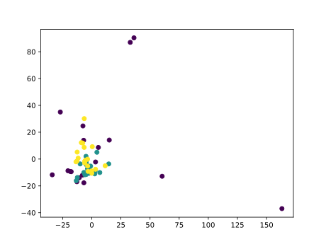

# Voice Identification using Arduino and MicroML

In this post I'm going to replicate the example found on the [Tensorflow github](https://github.com/tensorflow/tensorflow/tree/master/tensorflow/lite/experimental/micro/examples/micro_speech)
where an Arduino BLE 33 Nano Sense is used to recognize voice input. 
Here, however, I'm not using an Arm Cortex M4 chip: I'll use an Arduino Nano
(2 Kb of RAM) :fire::fire::fire:!

In this project the features are going to be the 50 analog readings from a microphone, 
taken starting from when a loud sound is detected, sampled at intervals of 5 millis.

The steps are almost the same depicted in the [tutorial about fruit identification](#todo):

 1. record sample data: repeat each word a few times and save the
 values from the serial monitor to a file, one for each gesture. *Note:
 voice as we're recording is veeeery noisy, so choose well distinguable
 words and speak clearly*
 2. train an SVM classifier on your laptop with Python's scikit-learn
 3. run `microml` on the trained classifier
 4. copy and include the `model.h` file in your Arduino project

This is the plot of three words I recorded as an example (2 pca components plotted).



As you can see, contrary to the previous two tutorial, this time we can't cleary
differentiate the samples with just 2 dimensions: this is why I told voice is noisy!
Still, we can achieve some sort of good accuracy even with this super-basic setup
(my average accuracy was 80%).

Now running the inference is just a matter of packing the 50 readings in an array
and call `predict`:

```cpp
#define debug(x) Serial.print(x);
#include "mic_model.h"

#define MIC A0
// prevent spikes - YOU MUST SET THIS TO YOUR OWN SENSITIVITY
#define MAX 50
#define TOLERANCE 10
#define NUM_SAMPLES 50

int32_t threshold;

uint16_t read() {
  return constrain(analogRead(MIC), 0, MAX);
}

void record() {
  for (int i = 0; i < NUM_SAMPLES; i++) {
      Serial.print(read());
      Serial.print(',');
      delay(5);
    }

    Serial.println("\n================");
}

void classify() {
  double features[NUM_SAMPLES] = {0};
  
  for (int i = 0; i < NUM_SAMPLES; i++) {
    features[i] = read();
    delay(5);
  }

  Serial.print("Detected ");
  Serial.println(classIdxToName(predict(features)));
}

void setup() {
  Serial.begin(115200);
  pinMode(MIC, INPUT);

  // at the beginning stay quiet
  // we'll create a baseline for "room noise" to detect 
  // when a word is being pronounced
  for (int i = 0; i < 200; i++)
    threshold += read();

  threshold /= 200;
}

void loop() {
  if (read() > threshold + TOLERANCE) {
    double features[NUM_SAMPLES] = {0};
    
    // comment out the one you don't need
    record();
    //classify();
    delay(1000);
  }

  delay(5);
}
```

Again I'll paste my `model.h` for reference. This time we have way more support
vectors (29) with a feature dimension of 50, so it's going to eat quite lot
of program space. If yours can't fit on you board, try shortening the number
of readings per sample (30-40 instead of 50).

```cpp

#pragma once

double apply_kernel(double *x, double *w) {
  double kernel = 0;

  for (uint8_t i = 0; i < 50; i++)
    kernel += x[i] * w[i];

  return kernel;
}

int predict(double *x) {
    double w[50] = { 0 };
    double kernels[29] = { 0 };
    double decisions[6] = { 0 };
    int votes[3] = { 0 };

    // compute kernels
    
    w[0] = 34.0; w[1] = 21.0; w[2] = 22.0; w[3] = 50.0; w[4] = 17.0; w[5] = 50.0; w[6] = 28.0; w[7] = 45.0; w[8] = 20.0; w[9] = 32.0; w[10] = 18.0; w[11] = 50.0; w[12] = 28.0; w[13] = 26.0; w[14] = 28.0; w[15] = 23.0; w[16] = 22.0; w[17] = 26.0; w[18] = 57.0; w[19] = 33.0; w[20] = 33.0; w[21] = 24.0; w[22] = 25.0; w[23] = 26.0; w[24] = 28.0; w[25] = 29.0; w[26] = 29.0; w[27] = 26.0; w[28] = 26.0; w[29] = 26.0; w[30] = 28.0; w[31] = 27.0; w[32] = 27.0; w[33] = 27.0; w[34] = 27.0; w[35] = 26.0; w[36] = 27.0; w[37] = 27.0; w[38] = 27.0; w[39] = 27.0; w[40] = 27.0; w[41] = 27.0; w[42] = 26.0; w[43] = 27.0; w[44] = 27.0; w[45] = 27.0; w[46] = 27.0; w[47] = 26.0; w[48] = 27.0; w[49] = 26.0; 
    kernels[0] = apply_kernel(x, w);    
    w[0] = 39.0; w[1] = 28.0; w[2] = 31.0; w[3] = 34.0; w[4] = 24.0; w[5] = 24.0; w[6] = 25.0; w[7] = 28.0; w[8] = 29.0; w[9] = 29.0; w[10] = 27.0; w[11] = 27.0; w[12] = 27.0; w[13] = 27.0; w[14] = 27.0; w[15] = 27.0; w[16] = 27.0; w[17] = 27.0; w[18] = 27.0; w[19] = 27.0; w[20] = 28.0; w[21] = 27.0; w[22] = 27.0; w[23] = 27.0; w[24] = 27.0; w[25] = 27.0; w[26] = 27.0; w[27] = 27.0; w[28] = 27.0; w[29] = 27.0; w[30] = 27.0; w[31] = 27.0; w[32] = 27.0; w[33] = 27.0; w[34] = 27.0; w[35] = 27.0; w[36] = 27.0; w[37] = 27.0; w[38] = 27.0; w[39] = 27.0; w[40] = 27.0; w[41] = 27.0; w[42] = 27.0; w[43] = 27.0; w[44] = 27.0; w[45] = 27.0; w[46] = 27.0; w[47] = 27.0; w[48] = 27.0; w[49] = 27.0; 
    kernels[1] = apply_kernel(x, w);    
    w[0] = 27.0; w[1] = 22.0; w[2] = 25.0; w[3] = 21.0; w[4] = 37.0; w[5] = 20.0; w[6] = 57.0; w[7] = 27.0; w[8] = 26.0; w[9] = 26.0; w[10] = 23.0; w[11] = 131.0; w[12] = 19.0; w[13] = 50.0; w[14] = 27.0; w[15] = 35.0; w[16] = 23.0; w[17] = 25.0; w[18] = 21.0; w[19] = 52.0; w[20] = 32.0; w[21] = 24.0; w[22] = 24.0; w[23] = 26.0; w[24] = 31.0; w[25] = 27.0; w[26] = 25.0; w[27] = 25.0; w[28] = 27.0; w[29] = 28.0; w[30] = 27.0; w[31] = 26.0; w[32] = 27.0; w[33] = 27.0; w[34] = 28.0; w[35] = 27.0; w[36] = 27.0; w[37] = 28.0; w[38] = 27.0; w[39] = 27.0; w[40] = 27.0; w[41] = 27.0; w[42] = 27.0; w[43] = 27.0; w[44] = 27.0; w[45] = 27.0; w[46] = 27.0; w[47] = 27.0; w[48] = 27.0; w[49] = 27.0; 
    kernels[2] = apply_kernel(x, w);    
    w[0] = 50.0; w[1] = 18.0; w[2] = 47.0; w[3] = 30.0; w[4] = 32.0; w[5] = 21.0; w[6] = 23.0; w[7] = 50.0; w[8] = 17.0; w[9] = 42.0; w[10] = 29.0; w[11] = 28.0; w[12] = 28.0; w[13] = 23.0; w[14] = 25.0; w[15] = 21.0; w[16] = 22.0; w[17] = 23.0; w[18] = 25.0; w[19] = 26.0; w[20] = 27.0; w[21] = 28.0; w[22] = 29.0; w[23] = 29.0; w[24] = 26.0; w[25] = 27.0; w[26] = 27.0; w[27] = 28.0; w[28] = 27.0; w[29] = 28.0; w[30] = 27.0; w[31] = 27.0; w[32] = 27.0; w[33] = 27.0; w[34] = 27.0; w[35] = 27.0; w[36] = 27.0; w[37] = 27.0; w[38] = 28.0; w[39] = 27.0; w[40] = 27.0; w[41] = 27.0; w[42] = 27.0; w[43] = 27.0; w[44] = 27.0; w[45] = 27.0; w[46] = 27.0; w[47] = 27.0; w[48] = 27.0; w[49] = 27.0; 
    kernels[3] = apply_kernel(x, w);    
    w[0] = 22.0; w[1] = 23.0; w[2] = 23.0; w[3] = 33.0; w[4] = 24.0; w[5] = 30.0; w[6] = 35.0; w[7] = 23.0; w[8] = 36.0; w[9] = 22.0; w[10] = 67.0; w[11] = 18.0; w[12] = 50.0; w[13] = 24.0; w[14] = 35.0; w[15] = 22.0; w[16] = 24.0; w[17] = 22.0; w[18] = 50.0; w[19] = 44.0; w[20] = 28.0; w[21] = 33.0; w[22] = 30.0; w[23] = 23.0; w[24] = 26.0; w[25] = 28.0; w[26] = 29.0; w[27] = 28.0; w[28] = 26.0; w[29] = 26.0; w[30] = 27.0; w[31] = 27.0; w[32] = 27.0; w[33] = 27.0; w[34] = 28.0; w[35] = 27.0; w[36] = 27.0; w[37] = 27.0; w[38] = 27.0; w[39] = 27.0; w[40] = 27.0; w[41] = 27.0; w[42] = 27.0; w[43] = 27.0; w[44] = 27.0; w[45] = 27.0; w[46] = 27.0; w[47] = 27.0; w[48] = 27.0; w[49] = 27.0; 
    kernels[4] = apply_kernel(x, w);    
    w[0] = 44.0; w[1] = 35.0; w[2] = 21.0; w[3] = 50.0; w[4] = 20.0; w[5] = 20.0; w[6] = 50.0; w[7] = 50.0; w[8] = 22.0; w[9] = 27.0; w[10] = 37.0; w[11] = 19.0; w[12] = 33.0; w[13] = 43.0; w[14] = 21.0; w[15] = 50.0; w[16] = 17.0; w[17] = 50.0; w[18] = 31.0; w[19] = 25.0; w[20] = 27.0; w[21] = 32.0; w[22] = 32.0; w[23] = 27.0; w[24] = 26.0; w[25] = 29.0; w[26] = 27.0; w[27] = 28.0; w[28] = 26.0; w[29] = 27.0; w[30] = 29.0; w[31] = 28.0; w[32] = 27.0; w[33] = 27.0; w[34] = 27.0; w[35] = 27.0; w[36] = 27.0; w[37] = 27.0; w[38] = 27.0; w[39] = 27.0; w[40] = 27.0; w[41] = 27.0; w[42] = 27.0; w[43] = 27.0; w[44] = 27.0; w[45] = 27.0; w[46] = 27.0; w[47] = 27.0; w[48] = 27.0; w[49] = 27.0; 
    kernels[5] = apply_kernel(x, w);    
    w[0] = 25.0; w[1] = 23.0; w[2] = 23.0; w[3] = 22.0; w[4] = 50.0; w[5] = 19.0; w[6] = 35.0; w[7] = 32.0; w[8] = 23.0; w[9] = 39.0; w[10] = 22.0; w[11] = 49.0; w[12] = 16.0; w[13] = 50.0; w[14] = 26.0; w[15] = 31.0; w[16] = 27.0; w[17] = 24.0; w[18] = 25.0; w[19] = 20.0; w[20] = 25.0; w[21] = 25.0; w[22] = 24.0; w[23] = 24.0; w[24] = 25.0; w[25] = 26.0; w[26] = 28.0; w[27] = 29.0; w[28] = 29.0; w[29] = 26.0; w[30] = 27.0; w[31] = 27.0; w[32] = 28.0; w[33] = 28.0; w[34] = 27.0; w[35] = 27.0; w[36] = 27.0; w[37] = 27.0; w[38] = 27.0; w[39] = 27.0; w[40] = 27.0; w[41] = 27.0; w[42] = 27.0; w[43] = 27.0; w[44] = 27.0; w[45] = 27.0; w[46] = 27.0; w[47] = 27.0; w[48] = 27.0; w[49] = 26.0; 
    kernels[6] = apply_kernel(x, w);    
    w[0] = 21.0; w[1] = 25.0; w[2] = 35.0; w[3] = 29.0; w[4] = 33.0; w[5] = 23.0; w[6] = 24.0; w[7] = 124.0; w[8] = 17.0; w[9] = 50.0; w[10] = 27.0; w[11] = 30.0; w[12] = 27.0; w[13] = 22.0; w[14] = 22.0; w[15] = 27.0; w[16] = 50.0; w[17] = 43.0; w[18] = 36.0; w[19] = 33.0; w[20] = 29.0; w[21] = 23.0; w[22] = 25.0; w[23] = 25.0; w[24] = 27.0; w[25] = 28.0; w[26] = 29.0; w[27] = 27.0; w[28] = 26.0; w[29] = 27.0; w[30] = 27.0; w[31] = 28.0; w[32] = 27.0; w[33] = 27.0; w[34] = 27.0; w[35] = 27.0; w[36] = 27.0; w[37] = 27.0; w[38] = 27.0; w[39] = 27.0; w[40] = 27.0; w[41] = 27.0; w[42] = 27.0; w[43] = 27.0; w[44] = 27.0; w[45] = 27.0; w[46] = 27.0; w[47] = 27.0; w[48] = 27.0; w[49] = 27.0; 
    kernels[7] = apply_kernel(x, w);    
    w[0] = 28.0; w[1] = 23.0; w[2] = 21.0; w[3] = 50.0; w[4] = 17.0; w[5] = 50.0; w[6] = 27.0; w[7] = 34.0; w[8] = 23.0; w[9] = 91.0; w[10] = 16.0; w[11] = 50.0; w[12] = 33.0; w[13] = 26.0; w[14] = 33.0; w[15] = 23.0; w[16] = 26.0; w[17] = 21.0; w[18] = 21.0; w[19] = 23.0; w[20] = 24.0; w[21] = 25.0; w[22] = 27.0; w[23] = 27.0; w[24] = 29.0; w[25] = 26.0; w[26] = 27.0; w[27] = 27.0; w[28] = 27.0; w[29] = 27.0; w[30] = 27.0; w[31] = 27.0; w[32] = 28.0; w[33] = 27.0; w[34] = 27.0; w[35] = 27.0; w[36] = 27.0; w[37] = 27.0; w[38] = 27.0; w[39] = 27.0; w[40] = 28.0; w[41] = 27.0; w[42] = 27.0; w[43] = 27.0; w[44] = 28.0; w[45] = 27.0; w[46] = 27.0; w[47] = 27.0; w[48] = 26.0; w[49] = 27.0; 
    kernels[8] = apply_kernel(x, w);    
    w[0] = 28.0; w[1] = 20.0; w[2] = 43.0; w[3] = 33.0; w[4] = 27.0; w[5] = 34.0; w[6] = 23.0; w[7] = 24.0; w[8] = 50.0; w[9] = 16.0; w[10] = 50.0; w[11] = 27.0; w[12] = 35.0; w[13] = 24.0; w[14] = 25.0; w[15] = 25.0; w[16] = 50.0; w[17] = 24.0; w[18] = 21.0; w[19] = 26.0; w[20] = 27.0; w[21] = 25.0; w[22] = 23.0; w[23] = 29.0; w[24] = 24.0; w[25] = 26.0; w[26] = 27.0; w[27] = 30.0; w[28] = 30.0; w[29] = 26.0; w[30] = 26.0; w[31] = 27.0; w[32] = 27.0; w[33] = 27.0; w[34] = 28.0; w[35] = 27.0; w[36] = 27.0; w[37] = 28.0; w[38] = 27.0; w[39] = 27.0; w[40] = 27.0; w[41] = 27.0; w[42] = 27.0; w[43] = 27.0; w[44] = 27.0; w[45] = 27.0; w[46] = 27.0; w[47] = 27.0; w[48] = 27.0; w[49] = 27.0; 
    kernels[9] = apply_kernel(x, w);    
    w[0] = 24.0; w[1] = 29.0; w[2] = 30.0; w[3] = 27.0; w[4] = 29.0; w[5] = 23.0; w[6] = 39.0; w[7] = 20.0; w[8] = 38.0; w[9] = 27.0; w[10] = 26.0; w[11] = 25.0; w[12] = 35.0; w[13] = 20.0; w[14] = 46.0; w[15] = 26.0; w[16] = 29.0; w[17] = 26.0; w[18] = 35.0; w[19] = 32.0; w[20] = 31.0; w[21] = 28.0; w[22] = 26.0; w[23] = 28.0; w[24] = 26.0; w[25] = 25.0; w[26] = 26.0; w[27] = 28.0; w[28] = 28.0; w[29] = 28.0; w[30] = 27.0; w[31] = 28.0; w[32] = 26.0; w[33] = 27.0; w[34] = 27.0; w[35] = 27.0; w[36] = 27.0; w[37] = 27.0; w[38] = 27.0; w[39] = 27.0; w[40] = 27.0; w[41] = 27.0; w[42] = 27.0; w[43] = 27.0; w[44] = 27.0; w[45] = 27.0; w[46] = 27.0; w[47] = 27.0; w[48] = 27.0; w[49] = 27.0; 
    kernels[10] = apply_kernel(x, w);    
    w[0] = 41.0; w[1] = 24.0; w[2] = 37.0; w[3] = 28.0; w[4] = 21.0; w[5] = 29.0; w[6] = 36.0; w[7] = 25.0; w[8] = 31.0; w[9] = 30.0; w[10] = 25.0; w[11] = 22.0; w[12] = 28.0; w[13] = 32.0; w[14] = 29.0; w[15] = 24.0; w[16] = 33.0; w[17] = 34.0; w[18] = 29.0; w[19] = 25.0; w[20] = 23.0; w[21] = 22.0; w[22] = 26.0; w[23] = 32.0; w[24] = 34.0; w[25] = 32.0; w[26] = 28.0; w[27] = 26.0; w[28] = 25.0; w[29] = 27.0; w[30] = 28.0; w[31] = 30.0; w[32] = 32.0; w[33] = 34.0; w[34] = 33.0; w[35] = 33.0; w[36] = 32.0; w[37] = 32.0; w[38] = 31.0; w[39] = 30.0; w[40] = 30.0; w[41] = 28.0; w[42] = 27.0; w[43] = 27.0; w[44] = 26.0; w[45] = 26.0; w[46] = 27.0; w[47] = 29.0; w[48] = 31.0; w[49] = 33.0; 
    kernels[11] = apply_kernel(x, w);    
    w[0] = 50.0; w[1] = 35.0; w[2] = 23.0; w[3] = 21.0; w[4] = 36.0; w[5] = 25.0; w[6] = 30.0; w[7] = 21.0; w[8] = 35.0; w[9] = 26.0; w[10] = 30.0; w[11] = 29.0; w[12] = 20.0; w[13] = 26.0; w[14] = 31.0; w[15] = 25.0; w[16] = 32.0; w[17] = 28.0; w[18] = 22.0; w[19] = 25.0; w[20] = 33.0; w[21] = 31.0; w[22] = 25.0; w[23] = 33.0; w[24] = 32.0; w[25] = 29.0; w[26] = 23.0; w[27] = 22.0; w[28] = 27.0; w[29] = 34.0; w[30] = 33.0; w[31] = 30.0; w[32] = 26.0; w[33] = 27.0; w[34] = 29.0; w[35] = 30.0; w[36] = 30.0; w[37] = 30.0; w[38] = 32.0; w[39] = 30.0; w[40] = 27.0; w[41] = 25.0; w[42] = 24.0; w[43] = 24.0; w[44] = 23.0; w[45] = 23.0; w[46] = 24.0; w[47] = 23.0; w[48] = 23.0; w[49] = 24.0; 
    kernels[12] = apply_kernel(x, w);    
    w[0] = 39.0; w[1] = 24.0; w[2] = 23.0; w[3] = 22.0; w[4] = 25.0; w[5] = 26.0; w[6] = 28.0; w[7] = 28.0; w[8] = 26.0; w[9] = 26.0; w[10] = 40.0; w[11] = 33.0; w[12] = 21.0; w[13] = 33.0; w[14] = 26.0; w[15] = 30.0; w[16] = 20.0; w[17] = 46.0; w[18] = 25.0; w[19] = 37.0; w[20] = 24.0; w[21] = 28.0; w[22] = 34.0; w[23] = 25.0; w[24] = 33.0; w[25] = 25.0; w[26] = 23.0; w[27] = 33.0; w[28] = 30.0; w[29] = 25.0; w[30] = 34.0; w[31] = 30.0; w[32] = 27.0; w[33] = 22.0; w[34] = 23.0; w[35] = 34.0; w[36] = 32.0; w[37] = 27.0; w[38] = 26.0; w[39] = 31.0; w[40] = 30.0; w[41] = 29.0; w[42] = 28.0; w[43] = 25.0; w[44] = 23.0; w[45] = 23.0; w[46] = 23.0; w[47] = 25.0; w[48] = 27.0; w[49] = 32.0; 
    kernels[13] = apply_kernel(x, w);    
    w[0] = 35.0; w[1] = 26.0; w[2] = 33.0; w[3] = 30.0; w[4] = 26.0; w[5] = 22.0; w[6] = 25.0; w[7] = 36.0; w[8] = 27.0; w[9] = 26.0; w[10] = 29.0; w[11] = 32.0; w[12] = 30.0; w[13] = 26.0; w[14] = 24.0; w[15] = 23.0; w[16] = 22.0; w[17] = 24.0; w[18] = 30.0; w[19] = 30.0; w[20] = 35.0; w[21] = 38.0; w[22] = 34.0; w[23] = 32.0; w[24] = 33.0; w[25] = 32.0; w[26] = 30.0; w[27] = 30.0; w[28] = 25.0; w[29] = 24.0; w[30] = 24.0; w[31] = 25.0; w[32] = 28.0; w[33] = 31.0; w[34] = 31.0; w[35] = 28.0; w[36] = 26.0; w[37] = 30.0; w[38] = 27.0; w[39] = 24.0; w[40] = 25.0; w[41] = 30.0; w[42] = 30.0; w[43] = 27.0; w[44] = 29.0; w[45] = 28.0; w[46] = 25.0; w[47] = 26.0; w[48] = 29.0; w[49] = 27.0; 
    kernels[14] = apply_kernel(x, w);    
    w[0] = 30.0; w[1] = 32.0; w[2] = 26.0; w[3] = 22.0; w[4] = 27.0; w[5] = 28.0; w[6] = 32.0; w[7] = 28.0; w[8] = 24.0; w[9] = 29.0; w[10] = 34.0; w[11] = 25.0; w[12] = 31.0; w[13] = 28.0; w[14] = 23.0; w[15] = 29.0; w[16] = 30.0; w[17] = 26.0; w[18] = 28.0; w[19] = 29.0; w[20] = 31.0; w[21] = 27.0; w[22] = 24.0; w[23] = 23.0; w[24] = 27.0; w[25] = 30.0; w[26] = 32.0; w[27] = 31.0; w[28] = 28.0; w[29] = 27.0; w[30] = 25.0; w[31] = 27.0; w[32] = 27.0; w[33] = 28.0; w[34] = 29.0; w[35] = 29.0; w[36] = 28.0; w[37] = 27.0; w[38] = 27.0; w[39] = 26.0; w[40] = 26.0; w[41] = 28.0; w[42] = 30.0; w[43] = 31.0; w[44] = 30.0; w[45] = 27.0; w[46] = 25.0; w[47] = 24.0; w[48] = 25.0; w[49] = 28.0; 
    kernels[15] = apply_kernel(x, w);    
    w[0] = 34.0; w[1] = 27.0; w[2] = 28.0; w[3] = 20.0; w[4] = 47.0; w[5] = 24.0; w[6] = 33.0; w[7] = 23.0; w[8] = 27.0; w[9] = 40.0; w[10] = 24.0; w[11] = 30.0; w[12] = 30.0; w[13] = 21.0; w[14] = 27.0; w[15] = 38.0; w[16] = 28.0; w[17] = 26.0; w[18] = 32.0; w[19] = 31.0; w[20] = 25.0; w[21] = 21.0; w[22] = 23.0; w[23] = 43.0; w[24] = 31.0; w[25] = 25.0; w[26] = 28.0; w[27] = 31.0; w[28] = 32.0; w[29] = 31.0; w[30] = 29.0; w[31] = 26.0; w[32] = 24.0; w[33] = 23.0; w[34] = 22.0; w[35] = 21.0; w[36] = 22.0; w[37] = 23.0; w[38] = 24.0; w[39] = 25.0; w[40] = 26.0; w[41] = 29.0; w[42] = 31.0; w[43] = 32.0; w[44] = 29.0; w[45] = 27.0; w[46] = 26.0; w[47] = 29.0; w[48] = 31.0; w[49] = 28.0; 
    kernels[16] = apply_kernel(x, w);    
    w[0] = 48.0; w[1] = 24.0; w[2] = 23.0; w[3] = 28.0; w[4] = 25.0; w[5] = 27.0; w[6] = 29.0; w[7] = 25.0; w[8] = 24.0; w[9] = 39.0; w[10] = 33.0; w[11] = 26.0; w[12] = 54.0; w[13] = 26.0; w[14] = 24.0; w[15] = 23.0; w[16] = 32.0; w[17] = 28.0; w[18] = 26.0; w[19] = 27.0; w[20] = 33.0; w[21] = 28.0; w[22] = 28.0; w[23] = 21.0; w[24] = 36.0; w[25] = 27.0; w[26] = 35.0; w[27] = 28.0; w[28] = 22.0; w[29] = 36.0; w[30] = 30.0; w[31] = 28.0; w[32] = 33.0; w[33] = 28.0; w[34] = 23.0; w[35] = 24.0; w[36] = 33.0; w[37] = 31.0; w[38] = 25.0; w[39] = 30.0; w[40] = 32.0; w[41] = 30.0; w[42] = 25.0; w[43] = 24.0; w[44] = 23.0; w[45] = 23.0; w[46] = 26.0; w[47] = 30.0; w[48] = 33.0; w[49] = 32.0; 
    kernels[17] = apply_kernel(x, w);    
    w[0] = 36.0; w[1] = 27.0; w[2] = 28.0; w[3] = 23.0; w[4] = 40.0; w[5] = 28.0; w[6] = 28.0; w[7] = 20.0; w[8] = 49.0; w[9] = 25.0; w[10] = 31.0; w[11] = 22.0; w[12] = 25.0; w[13] = 33.0; w[14] = 27.0; w[15] = 30.0; w[16] = 25.0; w[17] = 21.0; w[18] = 36.0; w[19] = 30.0; w[20] = 25.0; w[21] = 32.0; w[22] = 29.0; w[23] = 23.0; w[24] = 22.0; w[25] = 32.0; w[26] = 35.0; w[27] = 27.0; w[28] = 27.0; w[29] = 31.0; w[30] = 32.0; w[31] = 27.0; w[32] = 22.0; w[33] = 22.0; w[34] = 26.0; w[35] = 32.0; w[36] = 33.0; w[37] = 32.0; w[38] = 27.0; w[39] = 26.0; w[40] = 26.0; w[41] = 25.0; w[42] = 27.0; w[43] = 28.0; w[44] = 30.0; w[45] = 30.0; w[46] = 30.0; w[47] = 28.0; w[48] = 28.0; w[49] = 27.0; 
    kernels[18] = apply_kernel(x, w);    
    w[0] = 40.0; w[1] = 30.0; w[2] = 25.0; w[3] = 26.0; w[4] = 32.0; w[5] = 32.0; w[6] = 25.0; w[7] = 30.0; w[8] = 30.0; w[9] = 32.0; w[10] = 26.0; w[11] = 22.0; w[12] = 36.0; w[13] = 25.0; w[14] = 32.0; w[15] = 26.0; w[16] = 22.0; w[17] = 38.0; w[18] = 31.0; w[19] = 28.0; w[20] = 32.0; w[21] = 30.0; w[22] = 25.0; w[23] = 22.0; w[24] = 25.0; w[25] = 32.0; w[26] = 31.0; w[27] = 26.0; w[28] = 27.0; w[29] = 30.0; w[30] = 29.0; w[31] = 29.0; w[32] = 30.0; w[33] = 27.0; w[34] = 25.0; w[35] = 23.0; w[36] = 23.0; w[37] = 22.0; w[38] = 23.0; w[39] = 24.0; w[40] = 24.0; w[41] = 25.0; w[42] = 25.0; w[43] = 24.0; w[44] = 24.0; w[45] = 25.0; w[46] = 24.0; w[47] = 26.0; w[48] = 27.0; w[49] = 29.0; 
    kernels[19] = apply_kernel(x, w);    
    w[0] = 36.0; w[1] = 28.0; w[2] = 27.0; w[3] = 20.0; w[4] = 42.0; w[5] = 25.0; w[6] = 32.0; w[7] = 22.0; w[8] = 27.0; w[9] = 31.0; w[10] = 30.0; w[11] = 31.0; w[12] = 24.0; w[13] = 21.0; w[14] = 35.0; w[15] = 26.0; w[16] = 27.0; w[17] = 33.0; w[18] = 27.0; w[19] = 22.0; w[20] = 25.0; w[21] = 33.0; w[22] = 31.0; w[23] = 25.0; w[24] = 30.0; w[25] = 33.0; w[26] = 28.0; w[27] = 23.0; w[28] = 22.0; w[29] = 26.0; w[30] = 30.0; w[31] = 31.0; w[32] = 28.0; w[33] = 27.0; w[34] = 28.0; w[35] = 30.0; w[36] = 31.0; w[37] = 31.0; w[38] = 30.0; w[39] = 26.0; w[40] = 24.0; w[41] = 22.0; w[42] = 22.0; w[43] = 21.0; w[44] = 22.0; w[45] = 22.0; w[46] = 23.0; w[47] = 23.0; w[48] = 23.0; w[49] = 23.0; 
    kernels[20] = apply_kernel(x, w);    
    w[0] = 34.0; w[1] = 42.0; w[2] = 29.0; w[3] = 21.0; w[4] = 31.0; w[5] = 27.0; w[6] = 25.0; w[7] = 52.0; w[8] = 64.0; w[9] = 26.0; w[10] = 22.0; w[11] = 29.0; w[12] = 29.0; w[13] = 30.0; w[14] = 25.0; w[15] = 32.0; w[16] = 41.0; w[17] = 25.0; w[18] = 28.0; w[19] = 23.0; w[20] = 30.0; w[21] = 32.0; w[22] = 38.0; w[23] = 28.0; w[24] = 28.0; w[25] = 30.0; w[26] = 26.0; w[27] = 25.0; w[28] = 26.0; w[29] = 28.0; w[30] = 29.0; w[31] = 31.0; w[32] = 33.0; w[33] = 33.0; w[34] = 33.0; w[35] = 33.0; w[36] = 33.0; w[37] = 33.0; w[38] = 30.0; w[39] = 28.0; w[40] = 25.0; w[41] = 25.0; w[42] = 27.0; w[43] = 29.0; w[44] = 29.0; w[45] = 29.0; w[46] = 30.0; w[47] = 30.0; w[48] = 29.0; w[49] = 27.0; 
    kernels[21] = apply_kernel(x, w);    
    w[0] = 28.0; w[1] = 24.0; w[2] = 43.0; w[3] = 50.0; w[4] = 26.0; w[5] = 22.0; w[6] = 32.0; w[7] = 41.0; w[8] = 27.0; w[9] = 29.0; w[10] = 25.0; w[11] = 28.0; w[12] = 32.0; w[13] = 38.0; w[14] = 30.0; w[15] = 26.0; w[16] = 30.0; w[17] = 26.0; w[18] = 25.0; w[19] = 26.0; w[20] = 29.0; w[21] = 31.0; w[22] = 31.0; w[23] = 32.0; w[24] = 33.0; w[25] = 32.0; w[26] = 30.0; w[27] = 30.0; w[28] = 30.0; w[29] = 31.0; w[30] = 31.0; w[31] = 31.0; w[32] = 31.0; w[33] = 31.0; w[34] = 31.0; w[35] = 30.0; w[36] = 28.0; w[37] = 26.0; w[38] = 26.0; w[39] = 27.0; w[40] = 29.0; w[41] = 30.0; w[42] = 30.0; w[43] = 31.0; w[44] = 30.0; w[45] = 30.0; w[46] = 27.0; w[47] = 23.0; w[48] = 26.0; w[49] = 31.0; 
    kernels[22] = apply_kernel(x, w);    
    w[0] = 33.0; w[1] = 24.0; w[2] = 23.0; w[3] = 38.0; w[4] = 27.0; w[5] = 25.0; w[6] = 42.0; w[7] = 33.0; w[8] = 24.0; w[9] = 24.0; w[10] = 39.0; w[11] = 32.0; w[12] = 29.0; w[13] = 27.0; w[14] = 23.0; w[15] = 36.0; w[16] = 30.0; w[17] = 39.0; w[18] = 26.0; w[19] = 28.0; w[20] = 29.0; w[21] = 26.0; w[22] = 24.0; w[23] = 23.0; w[24] = 25.0; w[25] = 29.0; w[26] = 30.0; w[27] = 32.0; w[28] = 33.0; w[29] = 30.0; w[30] = 29.0; w[31] = 28.0; w[32] = 25.0; w[33] = 25.0; w[34] = 27.0; w[35] = 30.0; w[36] = 31.0; w[37] = 30.0; w[38] = 31.0; w[39] = 30.0; w[40] = 29.0; w[41] = 26.0; w[42] = 26.0; w[43] = 28.0; w[44] = 31.0; w[45] = 30.0; w[46] = 30.0; w[47] = 31.0; w[48] = 30.0; w[49] = 24.0; 
    kernels[23] = apply_kernel(x, w);    
    w[0] = 39.0; w[1] = 41.0; w[2] = 28.0; w[3] = 33.0; w[4] = 36.0; w[5] = 27.0; w[6] = 27.0; w[7] = 24.0; w[8] = 32.0; w[9] = 37.0; w[10] = 30.0; w[11] = 28.0; w[12] = 28.0; w[13] = 24.0; w[14] = 28.0; w[15] = 29.0; w[16] = 32.0; w[17] = 34.0; w[18] = 32.0; w[19] = 31.0; w[20] = 30.0; w[21] = 28.0; w[22] = 26.0; w[23] = 27.0; w[24] = 26.0; w[25] = 27.0; w[26] = 28.0; w[27] = 30.0; w[28] = 32.0; w[29] = 31.0; w[30] = 28.0; w[31] = 27.0; w[32] = 25.0; w[33] = 28.0; w[34] = 30.0; w[35] = 29.0; w[36] = 31.0; w[37] = 31.0; w[38] = 29.0; w[39] = 26.0; w[40] = 27.0; w[41] = 29.0; w[42] = 30.0; w[43] = 31.0; w[44] = 30.0; w[45] = 28.0; w[46] = 27.0; w[47] = 32.0; w[48] = 29.0; w[49] = 30.0; 
    kernels[24] = apply_kernel(x, w);    
    w[0] = 30.0; w[1] = 24.0; w[2] = 47.0; w[3] = 48.0; w[4] = 26.0; w[5] = 29.0; w[6] = 33.0; w[7] = 22.0; w[8] = 21.0; w[9] = 32.0; w[10] = 33.0; w[11] = 30.0; w[12] = 28.0; w[13] = 29.0; w[14] = 32.0; w[15] = 29.0; w[16] = 22.0; w[17] = 33.0; w[18] = 35.0; w[19] = 29.0; w[20] = 29.0; w[21] = 26.0; w[22] = 25.0; w[23] = 29.0; w[24] = 31.0; w[25] = 33.0; w[26] = 33.0; w[27] = 30.0; w[28] = 28.0; w[29] = 28.0; w[30] = 28.0; w[31] = 27.0; w[32] = 27.0; w[33] = 28.0; w[34] = 28.0; w[35] = 28.0; w[36] = 30.0; w[37] = 32.0; w[38] = 29.0; w[39] = 28.0; w[40] = 25.0; w[41] = 27.0; w[42] = 30.0; w[43] = 30.0; w[44] = 30.0; w[45] = 31.0; w[46] = 30.0; w[47] = 27.0; w[48] = 26.0; w[49] = 28.0; 
    kernels[25] = apply_kernel(x, w);    
    w[0] = 29.0; w[1] = 26.0; w[2] = 38.0; w[3] = 38.0; w[4] = 29.0; w[5] = 25.0; w[6] = 30.0; w[7] = 26.0; w[8] = 27.0; w[9] = 38.0; w[10] = 38.0; w[11] = 23.0; w[12] = 27.0; w[13] = 28.0; w[14] = 33.0; w[15] = 36.0; w[16] = 27.0; w[17] = 22.0; w[18] = 32.0; w[19] = 35.0; w[20] = 37.0; w[21] = 31.0; w[22] = 23.0; w[23] = 28.0; w[24] = 28.0; w[25] = 36.0; w[26] = 33.0; w[27] = 28.0; w[28] = 30.0; w[29] = 29.0; w[30] = 27.0; w[31] = 27.0; w[32] = 24.0; w[33] = 28.0; w[34] = 31.0; w[35] = 30.0; w[36] = 32.0; w[37] = 34.0; w[38] = 36.0; w[39] = 32.0; w[40] = 32.0; w[41] = 31.0; w[42] = 27.0; w[43] = 27.0; w[44] = 27.0; w[45] = 27.0; w[46] = 29.0; w[47] = 30.0; w[48] = 31.0; w[49] = 31.0; 
    kernels[26] = apply_kernel(x, w);    
    w[0] = 29.0; w[1] = 26.0; w[2] = 24.0; w[3] = 40.0; w[4] = 24.0; w[5] = 19.0; w[6] = 36.0; w[7] = 27.0; w[8] = 21.0; w[9] = 50.0; w[10] = 50.0; w[11] = 29.0; w[12] = 51.0; w[13] = 50.0; w[14] = 25.0; w[15] = 20.0; w[16] = 31.0; w[17] = 39.0; w[18] = 28.0; w[19] = 22.0; w[20] = 28.0; w[21] = 33.0; w[22] = 34.0; w[23] = 26.0; w[24] = 28.0; w[25] = 26.0; w[26] = 25.0; w[27] = 30.0; w[28] = 30.0; w[29] = 32.0; w[30] = 34.0; w[31] = 32.0; w[32] = 32.0; w[33] = 30.0; w[34] = 29.0; w[35] = 26.0; w[36] = 29.0; w[37] = 29.0; w[38] = 30.0; w[39] = 31.0; w[40] = 30.0; w[41] = 31.0; w[42] = 29.0; w[43] = 31.0; w[44] = 31.0; w[45] = 32.0; w[46] = 30.0; w[47] = 29.0; w[48] = 26.0; w[49] = 27.0; 
    kernels[27] = apply_kernel(x, w);    
    w[0] = 30.0; w[1] = 26.0; w[2] = 40.0; w[3] = 42.0; w[4] = 24.0; w[5] = 22.0; w[6] = 31.0; w[7] = 30.0; w[8] = 30.0; w[9] = 27.0; w[10] = 29.0; w[11] = 32.0; w[12] = 31.0; w[13] = 23.0; w[14] = 30.0; w[15] = 44.0; w[16] = 26.0; w[17] = 23.0; w[18] = 30.0; w[19] = 31.0; w[20] = 36.0; w[21] = 26.0; w[22] = 29.0; w[23] = 26.0; w[24] = 25.0; w[25] = 27.0; w[26] = 30.0; w[27] = 33.0; w[28] = 33.0; w[29] = 32.0; w[30] = 32.0; w[31] = 29.0; w[32] = 27.0; w[33] = 29.0; w[34] = 30.0; w[35] = 31.0; w[36] = 31.0; w[37] = 30.0; w[38] = 30.0; w[39] = 30.0; w[40] = 30.0; w[41] = 30.0; w[42] = 29.0; w[43] = 30.0; w[44] = 29.0; w[45] = 27.0; w[46] = 28.0; w[47] = 26.0; w[48] = 27.0; w[49] = 29.0; 
    kernels[28] = apply_kernel(x, w);    

    // vote
    decisions[0] = 9.3242428
         + kernels[1] * 0.0083848 + kernels[3] * 0.0008466 + kernels[4] * 0.0013306 + kernels[5] * 0.0002354 + kernels[6] * 0.0014898 + kernels[7] * 4.92e-05 + kernels[10] * 0.0015682
         + kernels[11] * -0.002098 + kernels[12] * -3.12e-05 + kernels[13] * -0.0007626 + kernels[14] * -0.0036687 + kernels[15] * -0.0026416 + kernels[16] * -0.0011717 + kernels[17] * -8.83e-05 + kernels[18] * -0.0013419 + kernels[19] * -0.0018651 + kernels[20] * -0.0002355;
    decisions[1] = 20.5710267
         + kernels[0] * 0.0001214 + kernels[1] * 0.0027142 + kernels[2] * 0.0003405 + kernels[5] * 0.0035654 + kernels[6] * 0.0010176 + kernels[7] * 0.0005156 + kernels[8] * 0.0004 + kernels[9] * 0.0030677 + kernels[10] * 0.001844
         + kernels[21] * -0.0023389 + kernels[22] * -0.0022136 + kernels[23] * -0.0056764 + kernels[24] * -0.0010669 + kernels[25] * -0.0014681 + kernels[27] * -0.000718 + kernels[28] * -0.0001047;
    decisions[2] = 12.4646555
         + kernels[11] * 0.0018262 + kernels[14] * 0.0015528 + kernels[15] * 0.0012418 + kernels[16] * 0.0004331 + kernels[18] * 0.0013177 + kernels[19] * 0.0001618
         + kernels[21] * -0.0013656 + kernels[22] * -0.0001614 + kernels[23] * -0.0007943 + kernels[24] * -0.0017963 + kernels[25] * -0.0015264 + kernels[26] * -0.0008398 + kernels[27] * -4.95e-05;

    votes[decisions[0] > 0 ? 0 : 1] += 1; 
    votes[decisions[1] > 0 ? 0 : 2] += 1; 
    votes[decisions[2] > 0 ? 1 : 2] += 1; 

    int classVal = -1;
    int classIdx = -1;

    for (int i = 0; i < 3; i++) {
        if (votes[i] > classVal) {
            classVal = votes[i];
            classIdx = i;
        }
    }

    return classIdx;
}

void self_test() {
    int correct = 0;
    double X[15][50] = {
             {  40.0 , 26.0 , 20.0 , 37.0 , 41.0 , 29.0 , 45.0 , 60.0 , 26.0 , 26.0 , 33.0 , 21.0 , 20.0 , 29.0 , 28.0 , 26.0 , 38.0 , 40.0 , 25.0 , 27.0 , 27.0 , 31.0 , 38.0 , 27.0 , 29.0 , 25.0 , 26.0 , 29.0 , 32.0 , 34.0 , 35.0 , 33.0 , 32.0 , 29.0 , 28.0 , 27.0 , 28.0 , 30.0 , 31.0 , 32.0 , 32.0 , 31.0 , 28.0 , 27.0 , 26.0 , 28.0 , 30.0 , 30.0 , 30.0 , 31.0  }
            , {  33.0 , 28.0 , 24.0 , 44.0 , 43.0 , 25.0 , 22.0 , 33.0 , 36.0 , 29.0 , 22.0 , 32.0 , 45.0 , 24.0 , 26.0 , 26.0 , 31.0 , 38.0 , 29.0 , 27.0 , 30.0 , 27.0 , 25.0 , 26.0 , 29.0 , 30.0 , 32.0 , 34.0 , 38.0 , 34.0 , 36.0 , 36.0 , 35.0 , 33.0 , 32.0 , 30.0 , 28.0 , 27.0 , 25.0 , 28.0 , 29.0 , 30.0 , 30.0 , 31.0 , 31.0 , 29.0 , 26.0 , 26.0 , 28.0 , 31.0  }
            , {  35.0 , 26.0 , 33.0 , 30.0 , 26.0 , 22.0 , 25.0 , 36.0 , 27.0 , 26.0 , 29.0 , 32.0 , 30.0 , 26.0 , 24.0 , 23.0 , 22.0 , 24.0 , 30.0 , 30.0 , 35.0 , 38.0 , 34.0 , 32.0 , 33.0 , 32.0 , 30.0 , 30.0 , 25.0 , 24.0 , 24.0 , 25.0 , 28.0 , 31.0 , 31.0 , 28.0 , 26.0 , 30.0 , 27.0 , 24.0 , 25.0 , 30.0 , 30.0 , 27.0 , 29.0 , 28.0 , 25.0 , 26.0 , 29.0 , 27.0  }
            , {  42.0 , 30.0 , 34.0 , 19.0 , 39.0 , 24.0 , 29.0 , 23.0 , 23.0 , 33.0 , 26.0 , 31.0 , 21.0 , 39.0 , 26.0 , 31.0 , 29.0 , 22.0 , 27.0 , 39.0 , 24.0 , 32.0 , 30.0 , 25.0 , 22.0 , 29.0 , 35.0 , 27.0 , 27.0 , 30.0 , 31.0 , 26.0 , 23.0 , 23.0 , 25.0 , 30.0 , 32.0 , 31.0 , 28.0 , 26.0 , 26.0 , 25.0 , 26.0 , 28.0 , 29.0 , 28.0 , 29.0 , 28.0 , 28.0 , 28.0  }
            , {  50.0 , 35.0 , 18.0 , 42.0 , 33.0 , 29.0 , 24.0 , 46.0 , 25.0 , 23.0 , 27.0 , 18.0 , 36.0 , 50.0 , 50.0 , 44.0 , 34.0 , 36.0 , 23.0 , 25.0 , 24.0 , 25.0 , 27.0 , 29.0 , 27.0 , 27.0 , 27.0 , 27.0 , 27.0 , 27.0 , 27.0 , 27.0 , 27.0 , 27.0 , 27.0 , 27.0 , 27.0 , 27.0 , 27.0 , 27.0 , 27.0 , 27.0 , 27.0 , 27.0 , 27.0 , 27.0 , 27.0 , 27.0 , 27.0 , 27.0  }
            , {  30.0 , 32.0 , 26.0 , 22.0 , 27.0 , 28.0 , 32.0 , 28.0 , 24.0 , 29.0 , 34.0 , 25.0 , 31.0 , 28.0 , 23.0 , 29.0 , 30.0 , 26.0 , 28.0 , 29.0 , 31.0 , 27.0 , 24.0 , 23.0 , 27.0 , 30.0 , 32.0 , 31.0 , 28.0 , 27.0 , 25.0 , 27.0 , 27.0 , 28.0 , 29.0 , 29.0 , 28.0 , 27.0 , 27.0 , 26.0 , 26.0 , 28.0 , 30.0 , 31.0 , 30.0 , 27.0 , 25.0 , 24.0 , 25.0 , 28.0  }
            , {  30.0 , 22.0 , 23.0 , 25.0 , 21.0 , 35.0 , 50.0 , 19.0 , 50.0 , 35.0 , 23.0 , 34.0 , 22.0 , 23.0 , 50.0 , 17.0 , 49.0 , 33.0 , 24.0 , 29.0 , 36.0 , 24.0 , 24.0 , 26.0 , 26.0 , 26.0 , 27.0 , 26.0 , 29.0 , 28.0 , 28.0 , 25.0 , 26.0 , 27.0 , 27.0 , 28.0 , 28.0 , 27.0 , 27.0 , 27.0 , 27.0 , 26.0 , 27.0 , 27.0 , 27.0 , 27.0 , 27.0 , 27.0 , 27.0 , 27.0  }
            , {  39.0 , 24.0 , 23.0 , 22.0 , 25.0 , 26.0 , 28.0 , 28.0 , 26.0 , 26.0 , 40.0 , 33.0 , 21.0 , 33.0 , 26.0 , 30.0 , 20.0 , 46.0 , 25.0 , 37.0 , 24.0 , 28.0 , 34.0 , 25.0 , 33.0 , 25.0 , 23.0 , 33.0 , 30.0 , 25.0 , 34.0 , 30.0 , 27.0 , 22.0 , 23.0 , 34.0 , 32.0 , 27.0 , 26.0 , 31.0 , 30.0 , 29.0 , 28.0 , 25.0 , 23.0 , 23.0 , 23.0 , 25.0 , 27.0 , 32.0  }
            , {  34.0 , 42.0 , 29.0 , 21.0 , 31.0 , 27.0 , 25.0 , 52.0 , 64.0 , 26.0 , 22.0 , 29.0 , 29.0 , 30.0 , 25.0 , 32.0 , 41.0 , 25.0 , 28.0 , 23.0 , 30.0 , 32.0 , 38.0 , 28.0 , 28.0 , 30.0 , 26.0 , 25.0 , 26.0 , 28.0 , 29.0 , 31.0 , 33.0 , 33.0 , 33.0 , 33.0 , 33.0 , 33.0 , 30.0 , 28.0 , 25.0 , 25.0 , 27.0 , 29.0 , 29.0 , 29.0 , 30.0 , 30.0 , 29.0 , 27.0  }
            , {  47.0 , 44.0 , 27.0 , 36.0 , 31.0 , 23.0 , 23.0 , 44.0 , 33.0 , 25.0 , 31.0 , 22.0 , 34.0 , 33.0 , 35.0 , 26.0 , 29.0 , 26.0 , 25.0 , 26.0 , 29.0 , 31.0 , 33.0 , 35.0 , 35.0 , 36.0 , 34.0 , 32.0 , 30.0 , 28.0 , 26.0 , 25.0 , 28.0 , 30.0 , 30.0 , 30.0 , 32.0 , 28.0 , 26.0 , 27.0 , 28.0 , 30.0 , 32.0 , 28.0 , 27.0 , 30.0 , 29.0 , 30.0 , 31.0 , 24.0  }
            , {  50.0 , 35.0 , 23.0 , 21.0 , 36.0 , 25.0 , 30.0 , 21.0 , 35.0 , 26.0 , 30.0 , 29.0 , 20.0 , 26.0 , 31.0 , 25.0 , 32.0 , 28.0 , 22.0 , 25.0 , 33.0 , 31.0 , 25.0 , 33.0 , 32.0 , 29.0 , 23.0 , 22.0 , 27.0 , 34.0 , 33.0 , 30.0 , 26.0 , 27.0 , 29.0 , 30.0 , 30.0 , 30.0 , 32.0 , 30.0 , 27.0 , 25.0 , 24.0 , 24.0 , 23.0 , 23.0 , 24.0 , 23.0 , 23.0 , 24.0  }
            , {  38.0 , 41.0 , 21.0 , 31.0 , 25.0 , 29.0 , 20.0 , 41.0 , 26.0 , 34.0 , 28.0 , 21.0 , 33.0 , 31.0 , 28.0 , 33.0 , 27.0 , 21.0 , 26.0 , 34.0 , 25.0 , 32.0 , 30.0 , 28.0 , 22.0 , 27.0 , 33.0 , 30.0 , 25.0 , 30.0 , 32.0 , 29.0 , 24.0 , 23.0 , 23.0 , 25.0 , 30.0 , 34.0 , 31.0 , 28.0 , 26.0 , 24.0 , 25.0 , 26.0 , 27.0 , 27.0 , 28.0 , 27.0 , 27.0 , 26.0  }
            , {  21.0 , 25.0 , 35.0 , 29.0 , 33.0 , 23.0 , 24.0 , 124.0 , 17.0 , 50.0 , 27.0 , 30.0 , 27.0 , 22.0 , 22.0 , 27.0 , 50.0 , 43.0 , 36.0 , 33.0 , 29.0 , 23.0 , 25.0 , 25.0 , 27.0 , 28.0 , 29.0 , 27.0 , 26.0 , 27.0 , 27.0 , 28.0 , 27.0 , 27.0 , 27.0 , 27.0 , 27.0 , 27.0 , 27.0 , 27.0 , 27.0 , 27.0 , 27.0 , 27.0 , 27.0 , 27.0 , 27.0 , 27.0 , 27.0 , 27.0  }
            , {  47.0 , 52.0 , 22.0 , 28.0 , 27.0 , 30.0 , 22.0 , 27.0 , 26.0 , 40.0 , 24.0 , 24.0 , 34.0 , 32.0 , 29.0 , 21.0 , 26.0 , 28.0 , 33.0 , 31.0 , 23.0 , 22.0 , 37.0 , 25.0 , 29.0 , 32.0 , 26.0 , 22.0 , 27.0 , 32.0 , 30.0 , 24.0 , 33.0 , 35.0 , 29.0 , 25.0 , 23.0 , 22.0 , 26.0 , 33.0 , 35.0 , 32.0 , 28.0 , 26.0 , 25.0 , 26.0 , 27.0 , 31.0 , 31.0 , 32.0  }
            , {  50.0 , 50.0 , 25.0 , 52.0 , 36.0 , 20.0 , 22.0 , 25.0 , 27.0 , 36.0 , 34.0 , 31.0 , 50.0 , 21.0 , 28.0 , 25.0 , 31.0 , 32.0 , 50.0 , 41.0 , 29.0 , 23.0 , 31.0 , 28.0 , 28.0 , 50.0 , 32.0 , 40.0 , 35.0 , 47.0 , 50.0 , 33.0 , 28.0 , 38.0 , 34.0 , 26.0 , 23.0 , 27.0 , 31.0 , 33.0 , 30.0 , 32.0 , 34.0 , 27.0 , 25.0 , 29.0 , 30.0 , 32.0 , 32.0 , 28.0  }
    };

    int y[15] = {  2.0 , 2.0 , 1.0 , 1.0 , 0.0 , 1.0 , 0.0 , 1.0 , 2.0 , 2.0 , 1.0 , 1.0 , 0.0 , 1.0 , 2.0  };

    for (int i = 0; i < 15; i++) {
        int predicted = predict(X[i]);

        debug('#');
        debug(i);
        debug("\t Expected ");
        debug(y[i]);
        debug("\tGot ");
        debug(predicted);
        debug('\t');
        debug(predicted == y[i] ? "OK\n" : "ERR\n");

        correct += (predicted == y[i]) ? 1 : 0;
    }

    debug("Run 15 predictions. ");
    debug(correct);
    debug(" were OK (");
    debug(100 * correct / 15);
    debug("%)");
}


const char* classIdxToName(uint8_t classIdx) {
    switch (classIdx) {

        case 0:
            return "otto";
        case 1:
            return "sei";
        case 2:
            return "uno";
        default:
            return "UNKNOWN";
    }
}
```